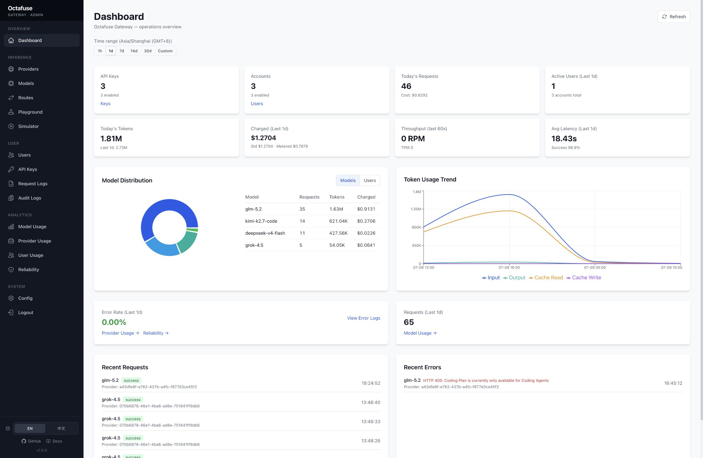
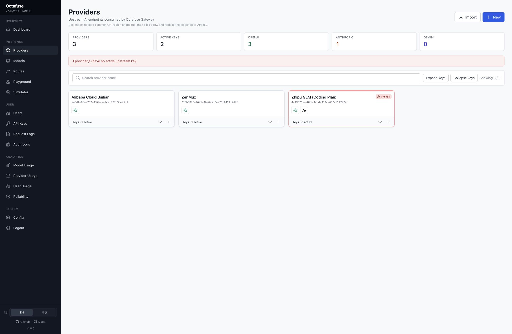
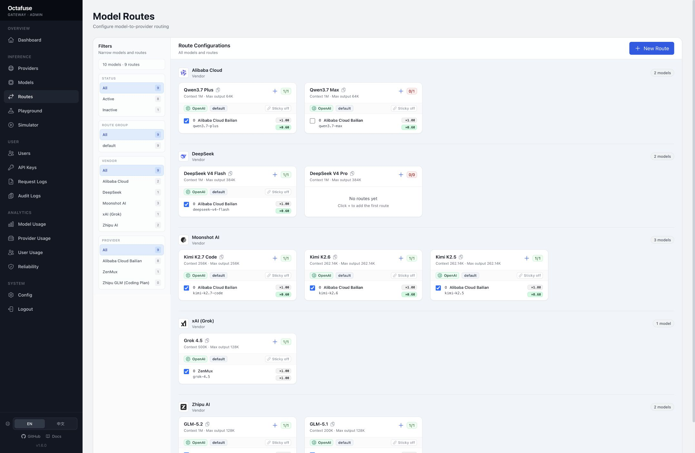
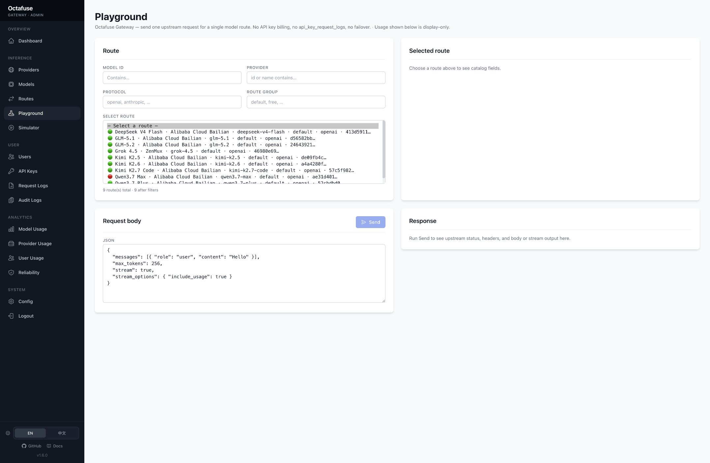

# Octafuse Gateway

[](./LICENSE)
[](https://github.com/OctaFuse/octafuse-gateway/releases)
[](https://github.com/OctaFuse/octafuse-gateway/actions/workflows/verify-package-versions.yml)
[](./.nvmrc)
[](./docs/operators/deployment/cloudflare-quickstart.md)
[](./docs/operators/deployment/docker.md)

**Octafuse Gateway** 是可自托管的开源 **AI Gateway**：把多供应商、多账号、多 API Key 收成 **一个 Base URL、一个 API Key**，并带路由、预算、计费与审计。

默认跑在 **Cloudflare Workers + D1** 上——个人与小流量通常可在免费额度内完成部署与日常使用；也支持 Docker / Postgres / MySQL 自托管（见[部署文档](./docs/operators/deployment/)）。

**English:** [README.en.md](./README.en.md) · **官网：** [octafuse.dev/zh](https://octafuse.dev/zh/)

## 为什么选 Octafuse

| | |
|---|---|
| **Cloudflare 可免费上云** | 一条 CLI 部署 Proxy + Admin + 共享 D1；无需自备服务器，边缘全球可用。 |
| **统一入口** | 客户端只配一个 Gateway URL 和一个 Key，即可走 OpenAI / Anthropic / Gemini 风格接口访问多上游。 |
| **可运营，不只是转发** | Admin 管理 Provider、Route、用户 Key 与预算；`/api/admin/*` 可对接门户或脚本；请求与成本可观测、可对账。 |

## 它能做什么

- **多模型入口合成一个入口**：同一模型 ID 可按优先级、权重或可用性路由到不同上游，便于切换、灰度和故障转移。
- **按用户 / 客户 / 团队发独立 Key**：设预算与周期重置；客户端可用 `GET /v1/me` 查额度。
- **明确的计费口径**：同时记录 `metered_cost`、`standard_cost`、`charged_cost`，便于对账或接入自有 billing。
- **集中观测**：请求日志、延迟、Token、模型 / Provider / 用户用量，不必在多个供应商控制台间切换。
- **上线前联调**：Playground 试调单路由（不计用户账单）；Simulator 模拟客户端调用。

## 适用场景

- **个人**：汇总各平台 Coding plan、模型账号与备用 Provider，用一把 Key 接入 IDE / CLI / 其它 AI 应用。
- **小团队**：多项目、多成员共用上游资源，用独立 Key + 预算分清用量与成本。
- **平台 / 企业**：通过 Admin API 开通用户、同步额度、审计请求，支撑计费与风控。
- **多供应商容灾**：上游不可用或额度不足时改路由策略，而不是改遍所有客户端。

## 界面预览

| 运营概览 | Provider 管理 |
|---|---|
|  |  |

| 模型路由 | Playground |
|---|---|
|  |  |

## 快速开始

默认路径是 **Cloudflare**：先在本机用 Wrangler + 本地 D1 跑通，再一键部署到你的 Cloudflare 账号。

```bash
git clone https://github.com/OctaFuse/octafuse-gateway.git
cd octafuse-gateway
```

### 1. 本机启动（本地 D1）

前置：Node.js **20+**。无需 Cloudflare 账号。

```bash
npm install
npm run db:migrate
npm run dev:proxy
```

另开一个终端：

```bash
npm run dev:admin
```

| 服务 | 地址 / 位置 |
|------|-------------|
| Proxy | `http://127.0.0.1:8787` |
| Admin | `http://127.0.0.1:8789` |
| 本地 D1 | `./.wrangler/state` |
| Admin API Bearer | `sk-dev-admin-key` |

### 2. 部署到 Cloudflare

前置：Cloudflare 账号，本机已 `npx wrangler login`。

```bash
npm install
npx wrangler login
npm run bootstrap:cloudflare
```

完成后按终端提示核对 `GATEWAY_URL` / `GATEWAY_MASTER_URL`，并用 `GET $GATEWAY_URL/health` 验证。完整步骤见 [Cloudflare 快速部署](./docs/operators/deployment/cloudflare-quickstart.md)；发版与 Workers Builds 见 [Cloudflare 运维](./docs/operators/deployment/cloudflare.md)。

### 3. 打开 Admin 后配置

1. 添加或导入 **Provider**，填入真实上游 API Key。
2. 创建或启用 **Model Route**。
3. 创建用户 **API Key**。
4. 用用户 Key 调用 Proxy。

```bash
curl -sS http://127.0.0.1:8787/v1/chat/completions \
  -H "Authorization: Bearer sk-your-api-key" \
  -H "Content-Type: application/json" \
  -d '{"model":"your-route-model","messages":[{"role":"user","content":"Hello"}]}'
```

上云后把主机换成你的 Proxy URL。

### 不用 Cloudflare？

Docker / Postgres / MySQL / Zeabur 等自托管路径见 [部署文档](./docs/operators/deployment/)（含 [Docker](./docs/operators/deployment/docker.md)）。

## 文档入口

| 读者 / 任务 | 链接 |
|-------------|------|
| 使用者：快速开始、功能、Admin 配置、客户端接入 | [docs/users/](./docs/users/) |
| 开发者：API、集成、本地开发、架构 | [docs/developers/](./docs/developers/) |
| 部署 / 运维：Cloudflare、Docker、Zeabur、迁移 | [docs/operators/](./docs/operators/) |
| 维护者：发版、Changesets、文档规范 | [docs/maintainers/](./docs/maintainers/) |
| HTTP 示例 | [examples/README.md](./examples/README.md) |

## 常用命令

```bash
npm install
npm run db:migrate            # 本地 D1
npm run dev:proxy             # Proxy :8787
npm run dev:admin             # Admin :8789

npm run bootstrap:cloudflare  # 首次部署到 Cloudflare
npm run deploy:cloudflare -- <instance> --migrate  # 已有实例发版

npm run db:migrate:pg         # Postgres（自托管）
npm run db:migrate:mysql      # MySQL 8（自托管）
```

## 贡献与安全

- [CONTRIBUTING.md](./CONTRIBUTING.md)
- [CODE_OF_CONDUCT.md](./CODE_OF_CONDUCT.md)
- [SECURITY.md](./SECURITY.md)
- [docs/CONVENTIONS.md](./docs/CONVENTIONS.md)

## 开源协议

本仓库使用 **GNU Affero General Public License v3.0（AGPLv3）** 授权，详见 [LICENSE](./LICENSE)。
