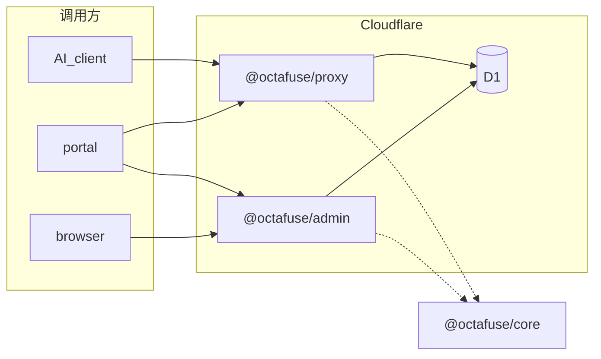

# Octafuse Gateway 文档

本仓库 **`octafuse`** 是 Gateway 的 **npm workspaces** 单体：**`packages/proxy`**（推理）与 **`packages/admin`**（管理 UI + `/api/admin/*`）共享 **`@octafuse/core`**。

## 必读

| 文档 | 说明 |
|------|------|
| [CONVENTIONS.md](./CONVENTIONS.md) | **文档分层规则 + 敏感信息规范**：什么留仓内、什么可外移、占位符与禁止值清单（PR review 必参考） |
| [architecture/runtime-data.md](./architecture/runtime-data.md) | **运行时（Cloudflare / Node）× 数据库（D1 / Postgres / MySQL）**、部署拓扑与迁移目录 |
| [architecture/user-keys-data-model.md](./architecture/user-keys-data-model.md) | **用户 / API Key / 预算**表关系、约束与鉴权扣费不变量 |

## 架构

| 文档 | 说明 |
|------|------|
| [architecture/proxy-request-lifecycle.md](./architecture/proxy-request-lifecycle.md) | **Proxy 请求处理逻辑**：鉴权、路由、限流/熔断/粘性、failover、场景分支 |
| [architecture/admin-layered.md](./architecture/admin-layered.md) | Admin 路由 / 服务 / 仓储分层 |

默认拓扑（Cloudflare + D1）：



| 包 | 运行时（典型） | 对外路径（摘要） | 数据 |
|----|----------------|------------------|------|
| `packages/proxy` | **CF Worker** 或 **Node** | `GET /`、`GET /health`、**`/v1/*`**、**`/v1beta/*`** | **D1**（Worker）或 **Postgres / MySQL**（Node） |
| `packages/admin` | **OpenNext + wrangler** 或 **Node** | 管理 UI；**`/api/admin/*`** | 与 Proxy **同源** |
| `packages/core` | 库 | 被 proxy / admin 引用 | **D1 / Postgres / MySQL**（驱动见 runtime-data） |

要点：**Proxy Worker 不挂载 `/admin/*`**。管理 HTTP 由 Admin 在 **`{GATEWAY_MASTER_URL}/api/admin/...`** 提供（Bearer `MASTER_KEY` 或已登录 Cookie）。

## 与下游门户的契约

| 变量 | 指向 |
|------|------|
| `GATEWAY_URL` | Proxy 根（用户推理） |
| `GATEWAY_MASTER_URL` | Admin 根；**`{GATEWAY_MASTER_URL}/api/admin/*`** |
| `GATEWAY_MASTER_KEY` | 与当前库 **`system_config.MASTER_KEY`** 一致 |

## API

| 文档 | 说明 |
|------|------|
| [api/README.md](./api/README.md) | 总览：Base URL、认证、错误形态 |
| [api/public.md](./api/public.md) / [api/user.md](./api/user.md) | 公开接口与用户接口（经 Proxy） |
| [api/admin.md](./api/admin.md) | 管理接口（对外 `/api/admin/*`） |

## 运维与部署

| 文档 | 说明 |
|------|------|
| [ops/deployment.md](./ops/deployment.md) | **部署索引**（入口） |
| [ops/deployment-cloudflare.md](./ops/deployment-cloudflare.md) | Cloudflare：本地 / dev 演示 / 生产 Git CI |
| [cloudflare-worker/README.md](../cloudflare-worker/README.md) | **Cloudflare 部署速查**（Build variables、`example.env`） |
| [ops/deployment-docker.md](./ops/deployment-docker.md) | Docker 镜像、Compose、GHCR |
| [ops/local-testing-environments.md](./ops/local-testing-environments.md) | 本地 D1 / Node + SQL |
| [ops/release-versioning.md](./ops/release-versioning.md) | Changesets、`vX.Y.Z`、镜像与 Release |
| [ops/postgres-cutover.md](./ops/postgres-cutover.md) | D1 ↔ Postgres 脚本（`scripts/db/cutover/`） |

**Compose 宿主机环境文件**：[docker/deploy/README.md](../docker/deploy/README.md)（从 `docker/examples/env.*.example` 复制）。

## 参考（行为与语义）

| 文档 | 说明 |
|------|------|
| [reference/streaming-billing.md](./reference/streaming-billing.md) | 流式计费与取消 |
| [reference/user-audit-logs.md](./reference/user-audit-logs.md) | 用户审计日志（`user_audit_logs`） |
| [reference/budget-audit-logs.md](./reference/budget-audit-logs.md) | 兼容跳转（→ user-audit-logs） |
| [reference/provider-thinking-configs.md](./reference/provider-thinking-configs.md) | 渠道思考类参数 |
| [reference/provider-import-presets.md](./reference/provider-import-presets.md) | Admin Provider 导入模板 |
| [reference/time-and-timezone.md](./reference/time-and-timezone.md) | 时间存储（UTC）、API 输出、Admin 显示时区与日界统计口径 |

## 仓库根常用命令

```bash
npm install
npm run db:migrate          # 本地 D1 → ./.wrangler/state
npm run dev:proxy           # Proxy Worker :8787
npm run dev:proxy:node      # Proxy Node + SQL :8787
npm run dev:admin           # Admin OpenNext preview + D1 :8789
npm run dev:admin:node      # Admin Node + SQL :8789
npm run deploy:proxy        # 须 dotenv -e cloudflare-worker/<instance>.env 或已 export 变量
npm run deploy:admin
```

Cloudflare 三条路径（本地 / example.dev / 生产）：**[cloudflare-worker/README.md](../cloudflare-worker/README.md)**。

D1 迁移目录：**`packages/core/migrations-d1/`**（`wrangler.d1.jsonc` 同目录）。Postgres：**`packages/core/migrations-postgres/`**（`npm run db:migrate:pg`）。MySQL：**`packages/core/migrations-mysql/`**（`npm run db:migrate:mysql`）。

应用层已移除的 user audit 兼容导出与迁移对照：见 **[`docs/migrations/user-audit-legacy-exports.md`](migrations/user-audit-legacy-exports.md)**。
