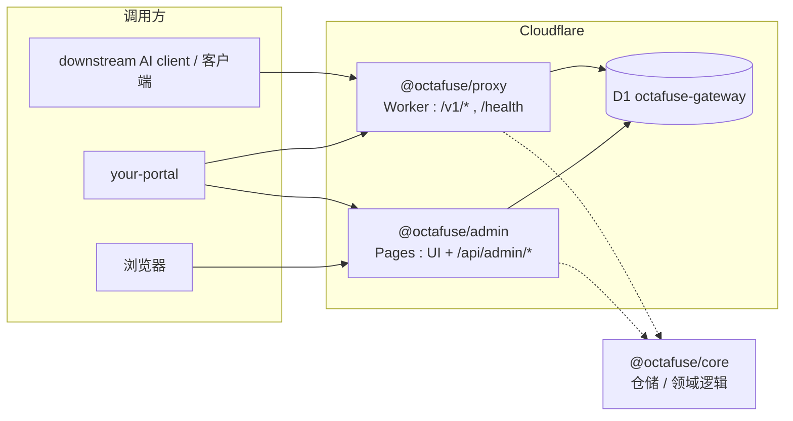

# Octafuse 文档索引

本仓库 **`octafuse`** 是 Gateway 的 **npm workspaces** 单体仓库：**Proxy**（`packages/proxy`）与 **Admin**（`packages/admin`）共享 **`@octafuse/core`**。

- **迁移策略**：为了后续产品化与开源，`packages/core/migrations-d1/`、`migrations-postgres/`、`migrations-mysql/` 作为新安装环境的**最终基线**维护；后续变更不再追加新的 core 迁移文件，而是直接把基线 SQL 调整到最终结果。已部署环境需要手工执行的变更 SQL 统一放在 **[manual-sql/](./manual-sql/)**，每次涉及库表或数据变更时同时提供 **D1** 与 **Postgres** 版本。
- **亦支持**：**Node.js** 进程（本机/Docker/K8s）+ **PostgreSQL**（`DATABASE_URL`），以及与 Cloudflare 混合的 **Hybrid**（例如 Proxy 用 PG、Admin 仍用 D1）。**运维约定**：**海外 Cloudflare 生产**以 **D1 `octafuse-gateway`** 为权威数据面；**中国境内 Docker 生产**以 **Postgres 网关库**为权威数据面（与海外 **默认不同步**）。PG/MySQL 亦用于本地与预发。

完整「运行时 × 数据库」矩阵、三种部署拓扑与迁移目录对照见 **[architecture/runtime-data.md](./architecture/runtime-data.md)**（必读索引）。

## 架构（默认：Cloudflare + D1）



| 包 | 运行时（典型） | 对外路径（摘要） | 数据 |
|----|----------------|------------------|------|
| `packages/proxy` | **CF Worker** 或 **Node**（`dev:proxy:node` / 容器） | `GET /`、`GET /health`、**`/v1/*`**、**`/v1beta/*`** | **D1**（仅 Worker）或 **Postgres**（仅 Node） |
| `packages/admin` | **OpenNext + wrangler** 或 **Node `next start`** | 管理 UI；**`/api/admin/*`** | 与 Proxy **同源**：同一 D1 或同一 Postgres |
| `packages/core` | 库（无独立进程） | 被 proxy / admin 引用 | 驱动抽象：D1 / Postgres |

非 Cloudflare 路径与 Hybrid 的细节见 [architecture/runtime-data.md](./architecture/runtime-data.md)、[ops/local-testing-environments.md](./ops/local-testing-environments.md)、[ops/deployment.md](./ops/deployment.md)。

要点：**Proxy Worker 不挂载 `/admin/*`**。所有管理类 HTTP 接口由 **Admin 应用** 在 **`{GATEWAY_MASTER_URL}/api/admin/...`**（Admin Pages 根 URL）上提供（Bearer `MASTER_KEY` 或已登录 Cookie）。

## 与平台门户的契约

| 变量（your-portal / your-portal (China-region example) 等） | 指向 |
|---------------------------|------|
| `GATEWAY_URL` | Proxy 根 URL（用户推理：`/v1/chat/completions` 等）；典型 **海外** `https://gateway.example.com`，**中国** `https://gateway-cn.example.com` |
| `GATEWAY_MASTER_URL` | Admin 根 URL；管理请求 **`{GATEWAY_MASTER_URL}/api/admin/...`**；典型 **海外** `https://gateway-admin.example.com`，**中国** `https://gateway-admin-cn.example.com` |
| `GATEWAY_MASTER_KEY` | 与**当前区**网关库 `system_config.MASTER_KEY` 一致（D1 或 Postgres） |

## 文档导航

| 文档 | 内容 |
|------|------|
| [architecture/runtime-data.md](./architecture/runtime-data.md) | **运行时（CF / Node）× 数据库（D1 / Postgres）**、部署模式与迁移目录 |
| [api/README.md](./api/README.md) | API 总览：双 Base URL、认证、错误形态 |
| [api/public.md](./api/public.md) / [user.md](./api/user.md) | 公开接口与用户接口（走 Proxy） |
| [api/admin.md](./api/admin.md) | 管理接口（路径约定：对外 `/api/admin/*`，正文以内部 `/admin/*` 描述） |
| [architecture/admin-layered.md](./architecture/admin-layered.md) | Admin 侧路由 / 服务 / 仓储分层（`packages/admin` + `packages/core`） |
| [ops/local-testing-environments.md](./ops/local-testing-environments.md) | 本地 D1、Proxy、Admin preview、可选 Node+Postgres / MySQL |
| [ops/deployment.md](./ops/deployment.md) | 部署索引 |
| [ops/deployment-cloudflare.md](./ops/deployment-cloudflare.md) | Cloudflare：**§0 Connect to Git**（推荐）、本机迁移与 `deploy:*`、`MASTER_KEY`、下游环境变量 |
| [ops/deployment-docker.md](./ops/deployment-docker.md) | 可选：Docker 双镜像 + 同一 Postgres 或 MySQL；含 **GitHub Actions → GHCR**（`octafuse-docker-images.yml` + 可选 `octafuse-docker-images-selfhosted.yml`） |
| [manual-sql/README.md](./manual-sql/README.md) | 已部署环境的手工 SQL：D1 与 Postgres 双版本、执行前提、回滚与自检 |
| [docker/deploy/README.md](../docker/deploy/README.md) | 服务器部署目录约定；`docker/deploy/.env.example` |
| [ops/postgres-cutover.md](./ops/postgres-cutover.md) | 可选：D1 ↔ Postgres 运维脚本（`scripts/db/cutover/`） |
| [reference/budget-audit-logs.md](./reference/budget-audit-logs.md) | 预算审计日志语义 |
| [reference/streaming-billing.md](./reference/streaming-billing.md) | 流式场景计费与取消 |
| [reference/provider-thinking-configs.md](./reference/provider-thinking-configs.md) | 渠道思考类参数配置说明 |
| [reference/provider-import-presets.md](./reference/provider-import-presets.md) | Admin：Providers 静态导入模板（预填 endpoint、占位 API Key） |

## 仓库根命令摘要

```bash
npm install
npm run db:migrate          # 本地 D1，持久化到 ./.wrangler/state
npm run dev:proxy           # Proxy Worker :8787
npm run dev:proxy:node      # Proxy Node + Postgres/MySQL :8787（根 .env：DATABASE_DRIVER + DATABASE_URL）
npm run dev:admin           # Admin：OpenNext preview（含 D1，:8789）
npm run dev:admin:node      # Admin Node + Postgres/MySQL :8789（根 .env：DATABASE_URL + ADMIN_*）
npm run deploy:proxy        # 部署 Worker
npm run deploy:admin        # 部署 Admin Pages
```

D1 迁移位于 **`packages/core/migrations-d1/`**；根目录 **`npm run db:migrate*`** 使用 **`packages/core/wrangler.d1.jsonc`**。Postgres 自托管时表结构在 **`packages/core/migrations-postgres/`**（由 **`npm run db:migrate:pg`** / **`packages/core/src/migrate/cli.ts`** 应用）；业务表在 **`octafuse_gateway`**，Node 运行时与 `db:migrate:pg` 通过连接参数固定 **`search_path=octafuse_gateway, public`**（见 `packages/core/src/storage/drizzle/client-postgres.ts`）。
