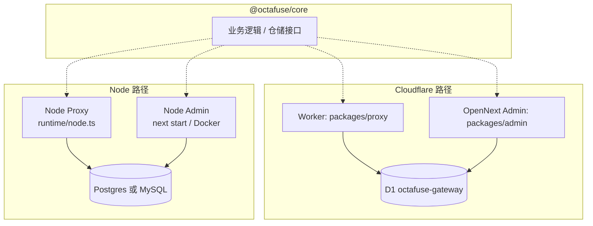
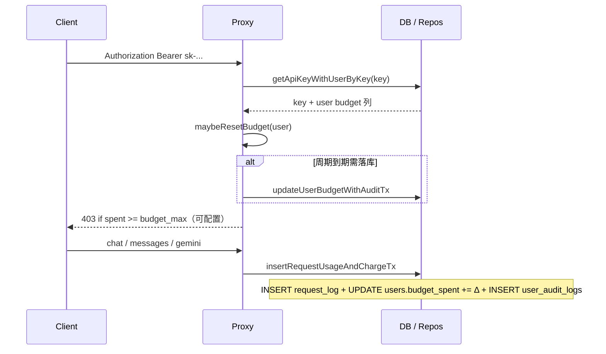

# 运行时与数据存储架构（Octafuse）

`@octafuse/core` 承载统一的类型、仓储与领域逻辑；**对外交付形态**由两套正交选择决定：

1. **运行时**：**Cloudflare 边缘**（Worker / Pages + OpenNext）或 **Node.js**（本机/Docker/K8s 等）。
2. **数据存储**：**D1**（SQLite、Cloudflare 绑定）、**PostgreSQL** 或 **MySQL 8**（均通过 Node 侧 **`DATABASE_URL`** + **`DATABASE_DRIVER`** 选择；Worker 仅 D1）。

二者组合后得到下文的「部署模式」。同一业务语义下，D1、Postgres 与 MySQL 使用**各自迁移目录**保持 schema 对齐（见文末）。

---

## 能力矩阵（按组件）

| 组件 | Cloudflare 运行时 | Node 运行时 | 数据库 |
|------|-------------------|-------------|--------|
| **Proxy**（`packages/proxy`） | Worker：`npm run dev:proxy` / `deploy:proxy`；**仅绑定 D1**，不用 `DATABASE_URL` | `npm run dev:proxy:node`（`packages/proxy/src/runtime/node.ts`）；**Postgres 或 MySQL**（`DATABASE_DRIVER` + `DATABASE_URL`） | **D1 ⊕ Postgres ⊕ MySQL**（同进程不能混用） |
| **Admin**（`packages/admin`） | OpenNext + wrangler：`npm run dev:admin` / `deploy:admin`；**绑定同一 D1** | 本地开发：`npm run dev:admin:node`（或 `packages/admin` 内 `npm run dev:node`，`:8789`）；生产：`next start` / Docker：需 **`DATABASE_URL`** + **`DATABASE_DRIVER`**（与 Proxy Node 同语义；Postgres 可省略驱动，**MySQL 须 `mysql`**）与 **`ADMIN_*`** | **D1 ⊕ Postgres ⊕ MySQL 二选一** |
| **Core**（`packages/core`） | 被 Worker / Pages 以 `d1` 驱动引用 | 被 Node 以 `postgres` / `mysql` 驱动引用 | 迁移见下 |

> **约束**：Cloudflare Worker **不能**直连外部 Postgres/MySQL；若在边缘保留 Worker，则数据库只能是 **D1**。要用 Postgres 或 MySQL，Proxy/Admin 须在 **Node** 跑（例如 Docker 自托管，见 [deployment-docker.md](../ops/deployment-docker.md)）。

---

## 部署模式（三种常见拓扑）

| 模式 | Proxy | Admin | 数据库 | 典型场景 |
|------|---------|--------|--------|----------|
| **A. Cloudflare 全托管（默认）** | Worker | Pages（OpenNext） | **共用 D1** | 生产默认；运维最简单 |
| **B. Hybrid** | **Node**（容器/VPS） | 仍为 **Cloudflare Pages** | Proxy=**Postgres**，Admin=**D1**（两库需分别迁移/对齐，适合分阶段上 PG） | 推理侧先行迁 PG，管理端仍在 CF |
| **C. Full Node + Postgres** | Node | Node（Next 容器等） | **同一 Postgres** | 全自托管、与 K8s/Docker 一致；见 Docker 文档 |
| **C′. Full Node + MySQL 8** | Node | Node（Next 容器等） | **同一 MySQL** | 与 C 相同交付形态；迁移目录 `migrations-mysql/` |

详细步骤与变量：

- 模式 A：[deployment-cloudflare.md](../ops/deployment-cloudflare.md)
- 模式 B / C、Docker、双镜像：[deployment-docker.md](../ops/deployment-docker.md)
- D1 ↔ Postgres 迁移/对账脚本：[postgres-cutover.md](../ops/postgres-cutover.md)
- 索引入口：[deployment.md](../ops/deployment.md)

---

## 关系示意（逻辑视图）

> 图中 **cf** 与 **node** 为并列交付方式；生产一般只选其中一条「竖条」（全 D1 或全关系型 PG/MySQL），Hybrid 则 Proxy 与 Admin 分别落在不同竖条（含两套存储）时需严格约定账号与迁移顺序。

---

## 迁移脚本位置

| 目标库 | SQL 目录 | 常用命令（仓库根） |
|--------|-----------|-------------------|
| **D1** | `packages/core/migrations-d1/` | `npm run db:migrate` / `db:migrate:remote`（`packages/core/wrangler.d1.jsonc`） |
| **PostgreSQL** | `packages/core/migrations-postgres/` | `npm run db:migrate:pg`（`packages/core/src/migrate/cli.ts` → `migrate/postgres.ts`） |
| **MySQL 8** | `packages/core/migrations-mysql/` | `npm run db:migrate:mysql`（同上 CLI → `migrate/mysql.ts`）；容器内 `db:migrate:mysql:docker` |

环境变量约定见仓库根 **[`.env.example`](../../.env.example)**；本地组合 D1 / PG / MySQL、Hybrid 调法见 **[local-testing-environments.md](../ops/local-testing-environments.md)**。

---

## 用户 / API Key / 用量数据流（Proxy）

鉴权与扣费路径在三种存储上一致，仅事务封装不同（D1 用 `batch()`；Postgres / MySQL 用 Drizzle 事务 + 条件 `UPDATE` 防并发 lazy reset 双写审计）。

- **表级关系与不变量**（email / external 约束、多 active key、级联规则）：[user-keys-data-model.md](./user-keys-data-model.md)。
- **审计事件与列语义**：[../reference/user-audit-logs.md](../reference/user-audit-logs.md)。

---

## Key 调度运行时状态（限流 / 粘性 / 熔断）

> **完整请求处理路径**（鉴权 → 路由 → 调度 → failover → 记账，含各场景分支表）：见 **[proxy-request-lifecycle.md](./proxy-request-lifecycle.md)**。

迁移 **0007** 引入两个 JSON 配置列（三库同语义；`NULL` = 功能关闭）：

| 列 | 含义 | 解析器（`@octafuse/core`） |
|----|------|---------------------------|
| `provider_api_keys.limit_config` | per-key 限流：`{"rpm":500,"tpm":200000,"max_concurrency":32}`，字段均可选 | `db/provider-key-limit-config.ts` |
| `models.sticky_config` | 粘性 key 路由（opt-in），按 `"{protocol}:{route_group}"` 配 rule，顶层可设 `ttl_seconds` / `short_wait_ms` 缺省 | `db/model-sticky-config.ts` |

请求调度由 `packages/proxy/src/services/` 下三个**进程内存**组件配合 `failover-dispatch.ts` 完成：

- **`provider-key-rate-limiter.ts`** — RPM（60s 滑动窗口，请求时计数）、TPM（流结束后按真实 usage 滞后入账）、并发（acquire/release 成对）；并输出 headroom 分数供分配排序。
- **`sticky-key-binding.ts`** — `userId + baseModelId + routeGroup + protocol → (providerId, keyId)`，空闲 TTL 过期；命中绑定的 key 优先出场，短暂限流时在 `short_wait_ms` 内等待而非换 key（保上游 prompt cache）。
- **`provider-key-circuit-breaker.ts`** — 替代原固定 60s cooldown：429 优先用上游 `Retry-After`，无头时按连续次数递增退避（30s→60s→5min→15min）；401/403 固定 10min；5xx/网络错误 60s。
- **`provider-key-scheduler.ts`（`buildKeyAttemptPlan`）** — 按 route priority 分层、同层多 provider 的 key 合并成池，池内按 key priority + headroom 加权随机排序，跳过熔断/限流中的 key。
- **`failover-dispatch.ts`** — 调度阶段若 `attempts` 为空（全部 key 熔断或网关限流），**直接返回 429** + `Retry-After`（`upstream_capacity_exhausted`），**不再**像旧版那样在 cooldown 中仍回退全试或落到 502；有可试 key 时仍按序打上游，全部失败则返回最后一次上游响应。

> **一致性注意**：以上状态均为**单实例进程内存**（与敏感内容熔断一致）。Cloudflare Workers 多 isolate 各自计数，为**软限制**——建议把 `limit_config` 配成供应商真实限额的 ~90%；Node 单进程部署则接近精确。粘性绑定跨 isolate 可能落到不同 key，属可接受的缓存命中率损耗。
