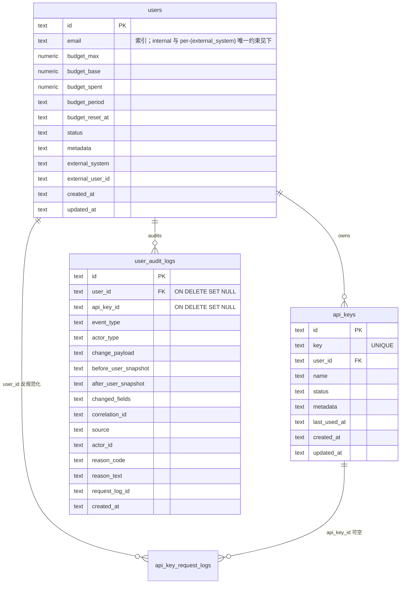

# 用户与 API Key 数据模型（Octafuse Gateway）

网关将**预算与周期**全部放在 **`users`**；**`api_keys`** 仅保存密钥材料、显示名、状态与 per-key `metadata`，通过 **`user_id`** 归属用户。三存储引擎（D1 / PostgreSQL / MySQL）的 DDL 以各自目录下的 **`0001_baseline.sql`** 为权威。

## 实体关系

## 不变量与约束

1. **`external_system` / `external_user_id`**：数据库 `CHECK` 要求二者**同空或同非空**；非空时用于上游幂等（`UNIQUE(external_system, external_user_id)`）。
2. **`email`**：在基线 schema 中通过 **partial UNIQUE** 约束「同一命名空间内」唯一：
   - `external_system IS NOT NULL` 时：`UNIQUE(external_system, email)`；
   - **internal 用户**（`external_system IS NULL`）：`UNIQUE(email)`（仅此类行参与）。
3. **`api_keys`**：不含任何 `budget_*` 或 `user_email`；列表/详情中的邮箱与预算来自 **`JOIN users`**。
4. **多把 active key**：同一 `user_id` 下允许多条 `status = 'active'` 的密钥；创建密钥**不**再按 user 幂等。
5. **删除语义**：
   - 删除 **`users`**：`ON DELETE CASCADE` 删除其 **`api_keys`**；子表中若存在指向该用户的 FK，按迁移定义处理（`user_audit_logs.user_id` 为 **`ON DELETE SET NULL`**，审计行保留）。
   - 删除 **`api_keys`**：**不**级联删除请求日志；`api_key_request_logs.api_key_id` 为 **`ON DELETE SET NULL`**，`user_id` 保留以便按用户维度统计历史。

## 请求日志与审计

- **`api_key_request_logs`**：写入时带 **`user_id`**（与鉴权时解析的 user 一致）及快照 **`user_email`**，便于全局检索而无需每次 `JOIN`。
- **`user_audit_logs`**：用户级审计（预算扣减、周期懒重置、管理端 patch、密钥生命周期等）；可选 **`api_key_id`** 归因「由哪把 key 触发」。详细语义见 [`../reference/user-audit-logs.md`](../reference/user-audit-logs.md)。

## 关键读写路径（与实现对齐）

- **鉴权**：`getApiKeyWithUserByKey` 单次 JOIN 读取 key + user 预算字段；周期懒重置走 **`updateUserBudgetWithAuditTx`**（Postgres/MySQL 带 `budget_reset_at` 条件更新以避免并发重复审计）。
- **扣费**：`insertRequestUsageAndChargeTx` 在同一事务内 **`INSERT api_key_request_logs`** + **`UPDATE users SET budget_spent = budget_spent + Δ`**（SQL 侧原子累加）+ **`INSERT user_audit_logs`**（`usage_charge`）。

## 验证（三引擎 / Proxy）

| 场景 | 命令或说明 |
|------|------------|
| **D1 + HTTP**（Admin/Proxy 已启动，Cloudflare 或本地 wrangler） | `npm run test:gateway:node-smoke` |
| **Postgres / MySQL 存储层并发扣费**（与 Proxy `recordUsage` 同一 `insertRequestUsageAndChargeTx`） | `npm run test:gateway:sql-storage-smoke`（需 `DATABASE_URL`；未配置则退出 0 跳过） |
| **关键写路径 mock**（D1 batch / PG 事务形状） | `npx tsx --test scripts/smoke/test-critical-write-paths.ts` |

详见 [`../../scripts/smoke/README.md`](../../scripts/smoke/README.md)。

## 相关文档

- [运行时与存储总览](./runtime-data.md)
- [管理 API：Users / Keys](../api/admin.md)
- [用户审计日志约定](../reference/user-audit-logs.md)
