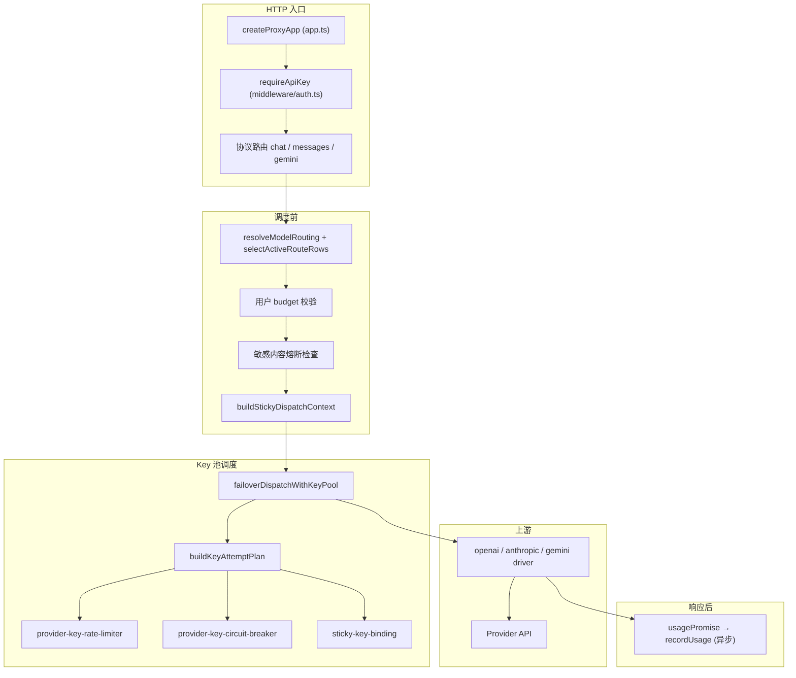
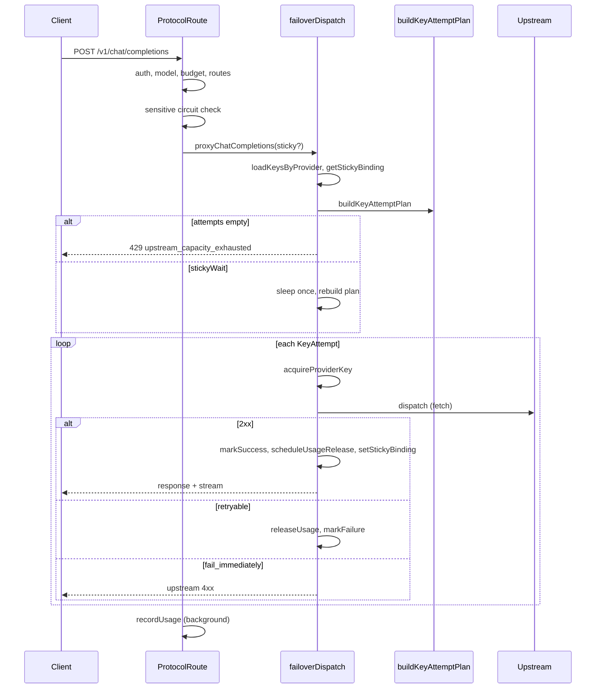

# Proxy 请求处理逻辑

本文档描述 **octafuse-gateway** `packages/proxy` 在收到一次 AI 推理请求后，从 HTTP 入口到上游 provider 调用、故障转移、异步记账的完整处理路径。

**适用路由**（三协议共用同一调度内核，差异仅在协议过滤与 egress driver）：

| 入口 | 协议 | 路由文件 |
|------|------|----------|
| `POST /v1/chat/completions` | OpenAI | `packages/proxy/src/routes/v1/chat.ts` |
| `POST /v1/messages` | Anthropic | `packages/proxy/src/routes/v1/messages.ts` |
| `POST /v1beta/models/{model}:generateContent` 等 | Gemini | `packages/proxy/src/routes/v1/gemini.ts` |

**相关文档**：

- 运行时状态与配置列概览：[runtime-data.md](./runtime-data.md) § Key 调度运行时状态
- 用户 API 故障转移摘要：[../api/user.md](../api/user.md) § 提供商故障转移
- 流式计费与 usage 解析：[../reference/streaming-billing.md](../reference/streaming-billing.md)

---

## 1. 入口与组件



| 组件 | 文件 | 职责 |
|------|------|------|
| App 装配 | `packages/proxy/src/app.ts` | Hono 应用、路由挂载、注入 `repositories` |
| 鉴权 | `middleware/auth.ts` → `services/api-key-auth.ts` | 提取 sk、校验 API Key、懒重置预算周期 |
| 模型路由 | `resolve-model-route-group.ts`、`route-selection.ts`、`model-router.ts` | 解析 `model` / `:route_group`、查 `model_routes`、JOIN provider |
| 代理入口 | `services/proxy.ts` | 三协议统一调用 `failoverDispatchWithKeyPool` |
| 故障转移 | `services/failover-dispatch.ts` | key 池预取、sticky 读/写、short wait、429 全忙、逐 key 打上游 |
| 调度计划 | `services/provider-key-scheduler.ts` | `buildKeyAttemptPlan`：priority + headroom + sticky 置顶 |
| 网关限流 | `services/provider-key-rate-limiter.ts` | RPM / TPM / 并发（进程内存） |
| Key 熔断 | `services/provider-key-circuit-breaker.ts` | 429 / 401 / 403 / 5xx / 网络错误冷却 |
| 粘性绑定 | `services/sticky-key-binding.ts` | `userId + baseModelId + routeGroup + protocol → key` |
| 失败分类 | `services/upstream-failure-classifier.ts` | 决定 retry_key vs fail_immediately |
| 敏感内容熔断 | `services/sensitive-content-circuit-*.ts` | 独立于 provider key，按 user + model 短路 |
| 用量记账 | `services/usage-tracker.ts` | 流结束后写 `api_key_request_logs`、累加 `budget_spent` |

---

## 2. 请求生命周期（逐步）

以下以 `POST /v1/chat/completions` 为例；`/v1/messages` 与 Gemini 路由在「协议过滤」与 driver 处不同，其余一致。

### 2.1 鉴权与解析

1. **`requireApiKey`**：从 `Authorization: Bearer sk-...`、`x-api-key` 或 query `key` 提取密钥；`authenticateApiKey` 查库并注入 `c.set('apiKey')`（含 `userId`、`budgetMax`、`budgetSpent` 等）。
2. **解析 JSON body**：非法 JSON → **400**；缺少 `model` → **400**。
3. **`resolveModelRouting`**：支持 `baseModelId` 或 `baseModelId:route_group`；模型不存在 → **404**。
4. **用户预算**：`budgetMax != null && budgetSpent >= budgetMax` → **403**（与 provider key 限流无关）。
5. **路由行查询**：
   - `getActiveModelRouteRows` → `selectActiveRouteRows(explicitGroup)`（默认 `default`）
   - `resolveRouteResultsFromRows` → `RouteResult[]`（携带 `providerEndpoints`：`parseProviderEndpoints(provider)`；**不再**在 router 层拼死完整上游 URL）
   - 无有效 route group → **400**
   - 解析异常 → **502**
6. **协议过滤**：例如 chat 路由保留 `upstreamProtocol === 'openai'`；无匹配 → **502**。
7. **Driver 出站 URL**：各 driver 按 capability 调用 `resolveUpstreamEndpoint`（`chat` / `images.generations` / `images.edits` / `messages` / `generateContent` / `streamGenerateContent`）。capability 模板优先，否则从 `base` 派生；Gemini 鉴权与 `alt=sse` 仍由 `prepareGeminiUpstreamFetch` 处理。

### 2.2 敏感内容熔断（可选，调度前）

- **`maybeBlockSensitiveContentCircuit`**：若 `userId + baseModelId` 处于熔断窗口（默认 **180s**），**不打上游**，返回 **429**，并异步记 error 日志。
- 上游 4xx 响应体命中敏感内容规则时，**`maybeTriggerSensitiveContentCircuitFromUpstream`** 写入熔断窗口；与 provider key 熔断 **独立**。

### 2.3 粘性上下文

- **`buildStickyDispatchContext`**：从 `models.sticky_config` 解析当前「协议 × route_group」的 rule；未配置或未启用 → `sticky = null`（行为与无粘性一致）。
- 绑定维度：`userId + baseModelId + routeGroup + protocol`（各协议独立，互不覆盖）。

### 2.4 Key 池调度与上游调用

**`proxyChatCompletions` → `failoverDispatchWithKeyPool`**：

1. 再次按 `expectedProtocol` 过滤 routes。
2. **`loadKeysByProvider`**：批量预取各 provider 的 `active` key 池。
3. 无 active key → **502** `No active provider keys configured`。
4. **`getStickyBinding`**：读取进程内粘性绑定（若启用）。
5. **`buildKeyAttemptPlan`**：生成 `attempts` 序列（见 §3）。
6. **Sticky short wait**（至多一次）：若绑定 key 仅因**网关限流**暂不可用且 `retryAfterMs ≤ short_wait_ms`，sleep 后**重建 plan**（第二次 `shortWaitMs=0`）。
7. **`plan.attempts.length === 0`** → **429** `upstream_capacity_exhausted` + `Retry-After`（**零上游调用**）。
8. **逐 attempt 执行**：
   - `acquireProviderKey`（RPM +1、并发 +1）
   - 调用协议 driver（`fetch` 上游）
   - **成功 (2xx)**：`markProviderKeySuccess` → `scheduleUsageRelease`（流结束后释放并发、入账 TPM）→ **`setStickyBinding` 刷新绑定** → 返回响应
   - **fetch 异常**：释放并发 → `markProviderKeyFailure(keyId, 'server')`（内部固定 60s 冷却）→ 记内部 502 → **换下一 key**
   - **非 2xx**：立即释放并发 → `classifyUpstreamHttpFailure`：
     - `fail_immediately`（400/404 等）→ **直接返回该响应**，不重试
     - `retry_key` → `markProviderKeyFailure` → **换下一 key**
9. 全部 attempt 失败 → 返回**最后一次**上游响应（可能是 429/5xx/4xx）。

### 2.5 响应与异步记账

1. **`materializeNonOkResponse`**：非 2xx 时物化 body 供日志与敏感内容检测。
2. **`usagePromise`** 与 **5min 超时** race：流结束解析 token；超时记 `incomplete`。
3. **`scheduleBackgroundWork` → `recordUsage`**：写 `api_key_request_logs`、累加 `budget_spent`；失败时可选 webhook 告警。



---

## 3. Key 调度决策顺序

`buildKeyAttemptPlan`（`provider-key-scheduler.ts`）是限流、熔断、sticky 三者的**交汇点**。

### 3.1 排序规则

1. 按 **`model_routes.priority` 降序**分层；**同层多个 provider 的 key 合并为一个池**（不再严格「先试完 A provider 再试 B」）。
2. 层内按 **`provider_api_keys.priority` 降序**分批。
3. 对每个 `(route, key)` 候选：
   - **`getProviderKeyCircuitRemainingMs > 0`** → 跳过，记录最早恢复时间
   - **`checkProviderKeyAvailability` 不可用** → 跳过；若是 sticky key 且 `retryAfterMs ≤ shortWaitMs` → 设置 `stickyWait`
   - sticky key 可用 → 暂存，**不参与批内排序**
   - 其余 eligible → 进入批内 headroom 排序
4. 批内按 **`getProviderKeyHeadroom` 降序**；余量差 **< 10%** 视为并列，并列段内 **weight 加权随机**。
5. 若有可用 sticky attempt → **`unshift` 到 attempts 首位**（可跨 route priority 层置顶）。

### 3.2 Headroom 定义

`headroom = min(RPM 剩余比, TPM 剩余比, 并发剩余比)`；未配置 `limit_config` 的 key headroom = **1**。

### 3.3 限流三阶段

| 阶段 | 函数 | 时机 |
|------|------|------|
| 调度检查 | `checkProviderKeyAvailability` | plan 构建时，**无副作用** |
| 占用 | `acquireProviderKey` | 每个 attempt **即将 dispatch 前** |
| 释放 | `releaseProviderKeyUsage` | 非 2xx 立即释放；2xx 挂 `usagePromise`，10min 兜底 |

- **RPM**：请求发起时 +1（60s 滑动窗口）。
- **TPM**：流结束后按真实 `total_tokens` 入账（滞后计数）。
- **并发满**：`retryAfterMs` 固定 **2000ms**（保守估计，非精确恢复时间）。

### 3.4 Key 熔断策略

| 失败类别 | 触发 | 冷却 |
|----------|------|------|
| `rate_limit` | 上游 **429** | 优先 `Retry-After`（封顶 15min）；否则连续 429 递增：**5s → 15s → 30s → 60s（封顶）** |
| `auth` | **401 / 403** | 固定 **10min** + 告警日志 |
| `server` | **5xx** 或 **fetch 抛错** | 固定 **60s** |

- `openUntil = max(现有, now + cooldown)`，短冷却不会覆盖更长冷却。
- **成功 (2xx)** → `markProviderKeySuccess`，清零连续 429 计数。
- 熔断窗口已打开时，同回合并发 429 **不再累加**连续计数（避免过度熔断）。
- 熔断中的 key **一律跳过**，不参与「回退全试」。

### 3.5 粘性绑定

| 条件 | 行为 |
|------|------|
| 无配置 / rule 未启用 | 不读写绑定，纯 headroom + failover |
| 有有效绑定且 key 可用 | 绑定 key **置顶**（可跨 priority 层） |
| 绑定 key **网关限流**，恢复 ≤ `short_wait_ms` | dispatch 层 **sleep 一次** 后重建 plan |
| 绑定 key **网关限流**，恢复 > `short_wait_ms` | 不等待，用其他 key；成功则 **改绑** |
| 绑定 key **熔断中** | **忽略绑定**，不 short wait，直接 failover |
| 绑定 key 已下线 / 不在候选池 | 等同无绑定；成功后写新绑定 |
| 上游 **2xx 成功** | `setStickyBinding` 刷新 TTL（默认 600s，可 per-rule 覆盖） |
| 空闲超过 TTL | 绑定过期，下次按 headroom 重选 |

> **实现说明**：绑定仅在**请求成功后**写入/刷新；首包无绑定时仍走常规 headroom 排序，成功后建立绑定。
>
> **Playground 除外**：Admin **`playground-service`** 直连单条 route 打上游，**不经过** `failoverDispatchWithKeyPool`，因此无 key pool failover 与粘性绑定；生产 Proxy 路径（`/v1/chat/completions` 等）才生效。

---

## 4. 场景分支表

### 4.1 调度前短路（不打上游）

| 场景 | HTTP | 响应要点 | 是否记账 |
|------|------|----------|----------|
| 非法 JSON | 400 | `Invalid JSON body` | 否 |
| 缺少 model | 400 | `Missing model` | 否 |
| 模型不存在 | 404 | `Model not found` | 否 |
| 用户 budget 耗尽 | 403 | `Budget exceeded` | 否 |
| route group 无 active 路由 | 400 | `No active routes for route group ...` | 否 |
| 无协议匹配路由 | 502 | `No OpenAI route ...` 等 | 否 |
| 敏感内容熔断中 | 429 | 网关生成，含 retry 信息 | 是（error） |
| 无 active provider key | 502 | `No active provider keys configured` | 否 |
| 全部 key 熔断或网关限流 | 429 | `upstream_capacity_exhausted` + `Retry-After` | 否 |

### 4.2 调度后 / 上游交互

| 场景 | 行为 | 客户端最终看到 |
|------|------|----------------|
| 首个 attempt 2xx | 成功返回，刷新 sticky | 上游 2xx + stream |
| 上游 429（单 key） | 熔断该 key，换下一 key | 若后续成功 → 2xx；全失败 → 最后上游 429 |
| 上游 5xx | 60s 熔断，换 key | 最后上游 5xx 或后续成功 |
| 上游 401/403 | 10min 熔断 + warn 日志，换 key | 最后上游响应或后续成功 |
| 上游 400/404 等 | **fail_immediately**，不重试 | 直接透传该 4xx |
| fetch 网络错误 | 60s 熔断，换 key；内部记 502 | 全失败时最后 502 或上游响应 |
| Sticky key 短暂限流 | sleep ≤ `short_wait_ms` 后重试绑定 key | 通常仍命中原 key |
| Sticky key 熔断 | 忽略绑定，failover 到其他 key | 成功则改绑 |
| 流式 usage 5min 未就绪 | **不**触发 key 熔断 | 2xx 仍返回；日志 `incomplete` |
| 客户端断开 | `cancelled` 状态 | 流中断；并发仍会通过 usage/release 释放 |

### 4.3 两类 429 的区别

| 来源 | 含义 | Body 特征 |
|------|------|-----------|
| **网关生成** | 调度阶段无任何可试 key | `code: upstream_capacity_exhausted`，**未调用上游** |
| **上游返回** | 某 key 被供应商限流 | 换 key 重试；全失败则**透传最后上游 429** |

---

## 5. 状态与一致性

以下均为**单实例进程内存**（与敏感内容熔断相同）：

| 状态 | 作用域 | Workers 多 isolate |
|------|--------|-------------------|
| Provider key 限流 | per `keyId` | 各 isolate 独立计数 → **软限制** |
| Provider key 熔断 | per `keyId` | 同上 |
| Sticky 绑定 | per `userId + model + group + protocol` | 可能跨 isolate 落到不同 key；进程内最多 **50_000** 条，满容量 purge 过期后仍满则**静默放弃写入** |
| 敏感内容熔断 | per `userId + baseModelId` | 同上 |

**运维建议**：

- `provider_api_keys.limit_config` 建议设为供应商真实限额的 **~90%**，让网关先行拦截并精确预估 `retryAfterMs`。
- Node 单进程部署计数更接近精确；Cloudflare Workers 需接受软限制与缓存命中率损耗。
- **TPM 滞后入账**：窗口内可能短暂多打几笔才触发拦截。
- **调度 vs acquire 竞态**：`checkProviderKeyAvailability` 与 `acquireProviderKey` 之间高并发可能短暂超配 RPM/并发。

**配置来源**（迁移 **0007**，三库同语义）：

| 列 | 含义 |
|----|------|
| `provider_api_keys.limit_config` | `{"rpm":500,"tpm":200000,"max_concurrency":32}`，NULL = 不限流 |
| `models.sticky_config` | opt-in 粘性规则，键 `"{protocol}:{route_group}"`；顶层缺省 `ttl_seconds=600`、`short_wait_ms=3000` |

---

## 6. 可观测性与日志

### 6.1 关键日志（Proxy stdout）

| 日志片段 | 含义 |
|----------|------|
| `sticky key busy, short-waiting {ms}ms keyId=...` | Sticky short wait 触发 |
| `calling provider providerId=... keyId=...` | 开始 attempt |
| `provider key non-OK, trying next candidate ... status=...` | 可重试失败，换 key |
| `fetch failed ... error=...` | 网络/fetch 异常 |
| `provider key auth issue, trying next key ...` | 401/403 告警 |
| `recordUsage failed ...` | 后台记账失败 |

### 6.2 用量日志字段

成功或失败后均异步写入 `api_key_request_logs`，含：

- `provider_key_id` / `provider_key_label` / `provider_key_fingerprint`（最终选用或最后失败的 key）
- `route_group`、`request_protocol`、`upstream_protocol`
- `status`：`success` / `error` / `incomplete` / `cancelled`
- `metered_cost` / `charged_cost` 等（见 streaming-billing 文档）

### 6.3 错误告警 Webhook

Proxy 在 `status = error` 且用量写入成功后，可向企业微信/飞书 webhook 发送归类摘要（上游超时、鉴权、限流、5xx、敏感内容等）。配置见 [admin.md](../api/admin.md)。

---

## 7. 代码索引（快速跳转）

```
packages/proxy/src/
├── app.ts                          # 路由挂载
├── middleware/auth.ts              # requireApiKey
├── routes/v1/
│   ├── chat.ts                     # OpenAI 主链路模板
│   ├── messages.ts                 # Anthropic
│   └── gemini.ts                   # Gemini
└── services/
    ├── proxy.ts                    # 三协议 → failoverDispatchWithKeyPool
    ├── failover-dispatch.ts        # 调度执行、sticky、429 全忙
    ├── provider-key-scheduler.ts   # buildKeyAttemptPlan
    ├── provider-key-rate-limiter.ts
    ├── provider-key-circuit-breaker.ts
    ├── sticky-key-binding.ts
    ├── upstream-failure-classifier.ts
    ├── sensitive-content-circuit-route.ts
    └── usage-tracker.ts
```

单测契约见 `packages/proxy/src/services/*.test.ts`（`failover-dispatch.test.ts`、`provider-key-scheduler.test.ts` 等）。
