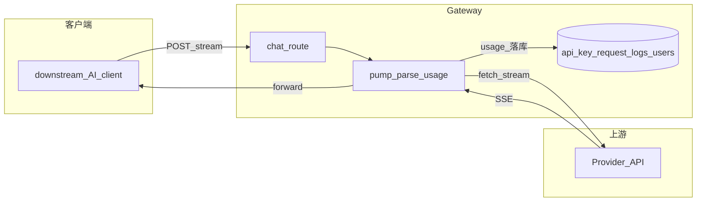
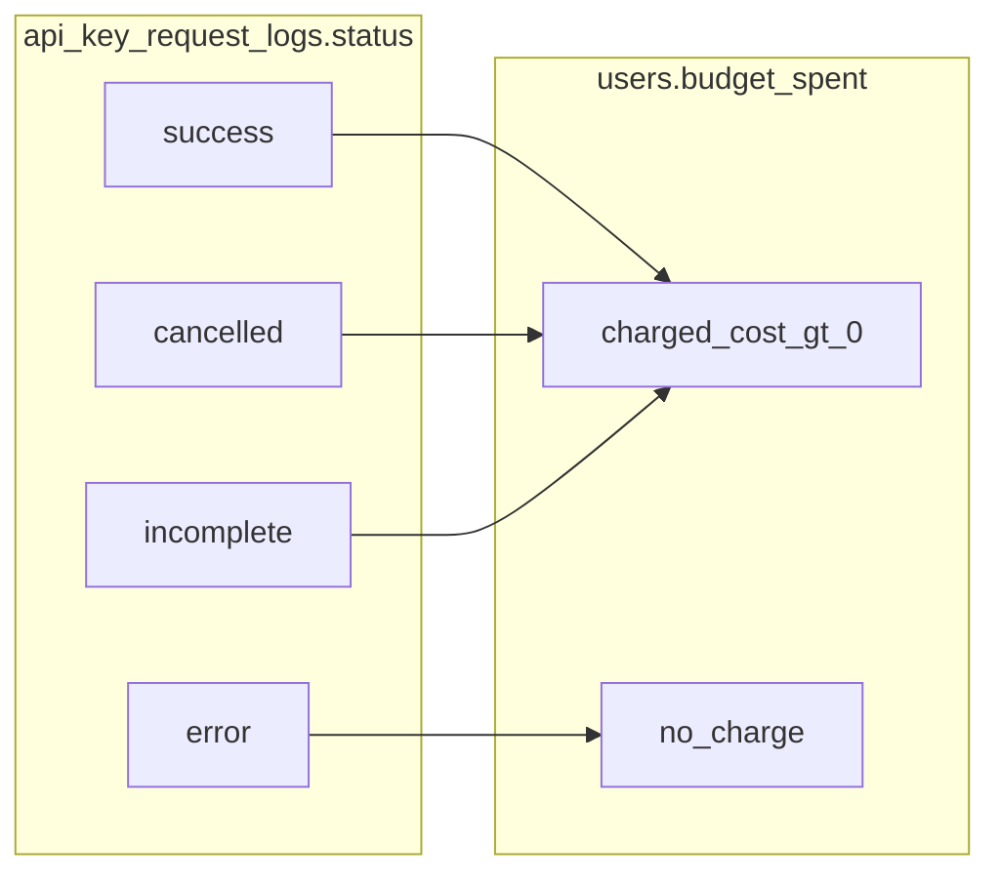

# 流式 Chat 计费与取消（当前实现）

Proxy（`@octafuse/proxy`）在流式请求（`POST /v1/chat/completions`、`POST /v1/responses`、`POST /v1/messages`、Gemini `streamGenerateContent` 等；实现见 `packages/proxy/src/services/egress/*-driver.ts`）中解析上游 SSE 的 `usage`，写入 `api_key_request_logs` 并更新 `users.budget_spent`。客户端中途取消或断连时，仍尽量在有限时间内从上游 **drain** 读出末尾 usage，避免长期 `incomplete` / 0 token。Responses 的 usage 通常来自终态事件（`response.completed` / `response.incomplete`），并计入 reasoning / cached tokens。

本文描述 Chat / Messages / Gemini 的流式 token 计费。Images、Audio 与 Agent Tools 分别使用 image token / 按张、audio token / 按时长、固定按次计费，见 [用户 API](../api/user.md) 与 [文生图模型说明](./image-models.md)。

## 架构示意



**旧问题（背景）**：若用 `TransformStream` + `flush()` 解析 usage，客户端 cancel 时 **`flush()` 不执行**，`usagePromise` 可能长期不 resolve。当前改为 **手动 pump**：断连后**只读上游、不写客户端**，在 `POST_DISCONNECT_DRAIN_MS` 内继续 read，再 `recordUsage`。

## 状态与扣费



- `success`：流正常结束。
- `cancelled`：客户端断开，drain 后 resolve。
- `incomplete`：流结束、空闲超时或绝对兜底后仍无完整收口。`error_message` 区分 `Stream idle timeout`（网关按空闲阈值掐流，即使已有部分 token 也记 incomplete，便于检索）、`Stream ended before usage available` 与 `Stream usage timeout (no usage within limit)`。
- `error`：上游非 2xx；**不**按该次结果扣 `budget_spent`。
- 扣费：`status !== 'error'` 且 `charged_cost > 0`。金额公式：目录 `models.pricing_profile` 按 `input_tokens` 选档后，再乘模型官方时段倍率得到官方当刻价（`standard_cost`）；路由侧用户计费 / 供应成本 = 官方当刻价 × 路由有效倍率。无路由 `schedule.mode`（存量）时有效倍率 = 基础倍率 × 命中窗 factor（未命中为 1）；`mode: "override"` 时命中窗用窗口 factor，未命中用基础倍率。若 `users.charged_cost_factors` 含该目录模型 ID，再对路由用户计费乘一次该倍率并六位四舍五入，得到最终 `charged_cost`（供应成本与官方当刻价不变；未命中不改金额）。模型与路由分时时段都在请求进入 Gateway 时锁定（业务时区下的 `HH:mm` 与可选 ISO 星期），长流式请求跨越边界不会切换倍率；该时刻写入 `pricing_audit` 的目录时段与路由时段（`evaluated_at_utc`、`local_weekday`）。嵌套 `price_override.metered` / `charged` tiers **忽略**。`pricing_audit` 新写入为 v5（可带 `catalog_schedule` 与 `user_charged_factor`；未命中为 `null`；v4 历史行仍可解析）。上线官方分时之前的日志 `standard_cost` 仍是裸目录价，不做回补。详见 `packages/proxy/src/services/usage-tracker.ts` 与 `packages/core/src/db/pricing-schedule.ts`。

## 常量

未设部署环境变量时使用下表默认值。代理服务（Proxy）在启动/请求时读取：

- **Node / Docker**：容器或进程环境变量
- **Cloudflare**：`npm run gen:wrangler` 把同名变量写入 wrangler `vars`；也可在 Dashboard **Settings → Variables** 覆盖

空 / 缺省 / 非正整数一律回退默认。这三档**不**进 `system_config`。

| 常量 / 环境变量 | 默认 | 含义 |
|------|--------|------|
| `POST_DISCONNECT_DRAIN_MS` | 各 driver 内定义（如 90s） | 断连后继续从上游读取的上限（暂不可配） |
| `STREAM_FIRST_CHUNK_TIMEOUT_MS` | 2 min | 尚未收到任何非空 chunk 时的等待上限，避免静默思考 / 超长上下文首包被 30s 空闲误杀 |
| `STREAM_IDLE_TIMEOUT_MS` | 30s | **已吐过 chunk 之后**两次上游 chunk 之间的空闲上限；超时则 cancel 上游，写入 `usage.stream_error=Stream idle timeout`，请求日志 `incomplete` |
| `USAGE_SAFETY_TIMEOUT_MS` | 10 min | `usagePromise` 未 resolve 的绝对兜底。正常长思考依赖空闲超时收口，不会把 Worker 拖满 10 分钟 |
| `STREAM_FIRST_EVENT_TIMEOUT_MS` | `system_config`，默认关闭 | 收到 2xx 后等待首个 SSE 事件的上限；超时返回 524 并 failover。覆盖 Chat Completions、Responses、Anthropic Messages、Gemini 流式。Images / Audio / Realtime / Tools **不**走此开关。未设路由组时只作用于 `default` |

**Workers**：`scheduleBackgroundWork` 内用 `ExecutionContext.waitUntil` 跑 `recordUsage`。**Node**：无 ExecutionContext 时退化为 detached Promise，语义仍是先响应、后台记账。

## Wrangler 配置

在 **`packages/proxy/wrangler.base.jsonc`**（生成后的 `wrangler.jsonc`）中启用请求取消信号（与断连检测配合）：

```jsonc
"compatibility_flags": ["nodejs_compat", "enable_request_signal"],
```

## 主要代码位置

| 文件 | 说明 |
|------|------|
| `packages/proxy/src/services/egress/openai-driver.ts` | OpenAI SSE：pump + drain + 空闲超时 |
| `packages/proxy/src/services/egress/openai-responses-driver.ts` | OpenAI Responses 流式 |
| `packages/proxy/src/services/egress/anthropic-driver.ts` | Anthropic 流式 |
| `packages/proxy/src/services/egress/gemini-driver.ts` | Gemini 流式 |
| `packages/proxy/src/services/egress/stream-idle-timeout.ts` | 流式 chunk 空闲超时 |
| `packages/proxy/src/services/stream-timeout-env.ts` | 部署环境变量覆盖三档时长 |
| `packages/proxy/src/services/stream-first-event-timeout.ts` | 首个 SSE 事件超时（灰度） |
| `packages/proxy/src/services/proxy.ts` | 组装路由与 `requestSignal` |
| `packages/proxy/src/routes/v1/chat.ts` 等 | 传入 signal、`cancelled` 状态 |
| `packages/proxy/src/services/usage-tracker.ts` | `recordUsage` |
| `packages/proxy/wrangler.base.jsonc` → 生成的 `wrangler.jsonc` | `enable_request_signal` |

## 限制与排查日志

- 上游在 drain 窗口内仍可能不发含 usage 的 chunk → 取消后 token 仍可能为 0。
- 部分请求仅出现 “Network connection lost” 而无 signal → 依赖写失败、空闲超时或安全超时。
- **静默思考 vs 持续吐 token**：首包到达前最多等 2 分钟（可用 `STREAM_FIRST_CHUNK_TIMEOUT_MS` 覆盖）；一旦开始吐 chunk，间隔超过 30s 才掐流（`STREAM_IDLE_TIMEOUT_MS`）。持续吐 chunk 的长思考会等到流结束再记账，不再被空 usage 兜底记成 0 token。
- **SSE 心跳会重置空闲计时**：计时按 TCP chunk，不区分 `data:` 与 comment / ping。上游若定期打心跳却永不给 usage，要等到绝对兜底（默认 10 分钟，`USAGE_SAFETY_TIMEOUT_MS`）才记 `incomplete`。
- **首包 524 灰度覆盖四个文本流式入口**（Chat Completions、Responses、Anthropic Messages、Gemini `streamGenerateContent`）。Images / Audio / Realtime / Tools 假 2xx 不会走 `STREAM_FIRST_EVENT_TIMEOUT_MS`。

日志关键词：`client disconnected, draining upstream`、`drain timeout`、`stream idle timeout`、`first SSE event timeout`、`recordUsage`、`status=cancelled`、`error_message=Stream idle timeout`。
