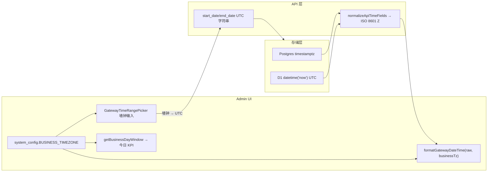

# 时间与时区（当前实现）

Gateway 在**存储**、**API 输出**、**Admin 显示/输入**与**日界统计**上采用分层口径。本文记录当前代码契约，便于 review 与跨模块对照。

## 总览

| 维度 | 口径 | 说明 |
|------|------|------|
| 数据库写入 | **UTC** | 各驱动统一存 UTC instant |
| API 响应时间字段 | **ISO 8601 UTC（`Z`）** | `normalizeApiTimeFields` 深度归一化 |
| API 查询 `start_date` / `end_date` | **UTC** | 格式 `YYYY-MM-DD HH:mm:ss`（无 `Z`） |
| Admin 逐条时间戳显示 | **`BUSINESS_TIMEZONE`** | `useGatewayDateTime()` → `formatGatewayDateTime(raw, tz)` |
| Admin 时间范围自定义输入 | **`BUSINESS_TIMEZONE` 墙钟** | `GatewayTimeRangePicker` 在 UI 按业务时区输入/回显，Apply 后转 UTC 查询 |
| 「今日 / 日界」统计 | **`BUSINESS_TIMEZONE`** | `getBusinessDayWindow` |

Admin 登录后通过 `GET /admin/business-timezone` 加载当前业务时区（`BusinessTimezoneProvider`）；Config 页保存 `BUSINESS_TIMEZONE` 后会刷新 Provider。

## 1. 存储：一律 UTC

### PostgreSQL

Drizzle schema 中时间列使用 `timestamp(..., { withTimezone: true, mode: 'string' })`，底层为 `timestamptz`，语义为 UTC instant。

- 实现：`packages/core/src/storage/drizzle/schema.pg.ts`
- 迁移：`packages/core/migrations-postgres/0001_baseline.sql`

### D1 / SQLite

时间列多为 `TEXT`，默认值 `datetime('now')`。SQLite 的 `datetime('now')` 返回 UTC，形态为 `YYYY-MM-DD HH:MM:SS`（无偏移后缀）。

- 迁移：`packages/core/migrations-d1/0001_baseline.sql`（示例：`created_at TEXT NOT NULL DEFAULT (datetime('now'))`）

### MySQL

与 Postgres 对齐，迁移目录：`packages/core/migrations-mysql/`。

### 应用层写入

业务代码写入时间时，普遍使用 `new Date().toISOString()` 或 `toISOString().slice(0, 19).replace('T', ' ')` 等形式，语义均为 UTC。

## 2. API 输出：统一 ISO 8601 UTC

对外 Admin / 部分 Proxy 响应在序列化前经 `normalizeApiTimeFields` 处理（`packages/core/src/lib/time-format.ts`）：

- **D1 / SQLite 无时区串**（`YYYY-MM-DD HH:MM:SS`）：按历史约定视为 UTC，输出 `YYYY-MM-DDTHH:MM:SS.000Z`。
- **PostgreSQL 等带偏移或 `T` 分隔的串**：经 `Date` 解析后统一为 `toISOString()`（带 `Z`）。

约定的时间字段名（`API_TIME_KEYS`）：

- `created_at`
- `updated_at`
- `budget_reset_at`
- `before_budget_reset_at`
- `after_budget_reset_at`
- `last_active_at`

下游门户调用 `{GATEWAY_MASTER_URL}/api/admin/*` 时，应把上述字段当作 **UTC instant**，自行按产品需求转换展示时区。

## 3. Admin UI：显示与筛选 = 业务时区

Admin 前端格式化函数位于 `packages/admin/lib/datetime.ts`：

- `parseGatewayDateTime(raw)`：将 API 串（含 D1 无 `Z` 形态）解析为 `Date`（UTC instant）。
- `formatGatewayDateTime(raw, timeZone?)`：用 `Intl.DateTimeFormat` 渲染；列表/详情页通过 **`useGatewayDateTime()`** 传入 `BUSINESS_TIMEZONE`。

时间范围组件 `GatewayTimeRangePicker`（`packages/admin/components/GatewayTimeRangePicker.tsx`）：

- 快捷预设（`1h`、`7d` 等）仍按相对当前时刻计算 UTC 边界（`rangeToParams`）。
- **自定义范围**：`datetime-local` 按 **业务时区墙钟** 输入/回显（`utcApiToZonedInput` / `zonedInputToUtcApi`，算法见 `@octafuse/core/lib/business-timezone`），Apply 后转为 UTC `start_date` / `end_date` 查询 API。
- 标签展示当前业务时区（如 `Asia/Shanghai (GMT+8)`）。

换算工具：

- Core：`packages/core/src/lib/business-timezone.ts`（`utcApiToZonedInput`、`zonedInputToUtcApi` 等）
- Admin 封装：`packages/admin/lib/business-timezone-client.ts`

因此：**无论管理员浏览器本地时区为何**，同一 `BUSINESS_TIMEZONE` 下看到的逐条时间戳与自定义筛选输入一致；与「今日」KPI 日界口径对齐。

## 4. `BUSINESS_TIMEZONE`：日界 + Admin 显示

### 配置来源

- 键：`system_config.BUSINESS_TIMEZONE`
- 种子默认：`UTC`（`packages/core/migrations-{d1,postgres,mysql}/0002_seed.sql`）
- Admin Config 页：`/gateway/config` →「业务时区」
- 读取 API：`GET /admin/business-timezone` → `{ business_timezone }`
- 非法或未配置 IANA 名称时回落 `UTC`（`getBusinessTimezone`）

### 行为

`getBusinessDayWindow(now, businessTimeZone)` 根据业务时区计算「今天」的 `dateKey`，并返回与 DB `created_at` 比较的 **UTC 边界字符串**（`startUtcSql`、`endExclusiveUtcSql`）。

主要调用点：

- Admin 仪表盘「今日」卡片：`dashboard-service.ts` → `getAdminStatsService`
- Admin 全站时间列与自定义时间窗（见上一节）

API 文档中的相关说明见 [`docs/developers/api/admin.md`](../api/admin.md)（时间与时区约定一节）。

## 5. 小结与常见误解

| 误解 | 实际 |
|------|------|
| 「Admin 显示按浏览器本地时区」 | **已统一为 `BUSINESS_TIMEZONE`**（2026-07 起） |
| 「时间范围标签写 UTC 就是按 UTC 输入」 | 旧版自定义输入曾误用浏览器本地；现按 **业务时区墙钟** |
| 「D1 存的是本地时间」 | D1 `datetime('now')` 与代码约定均视为 **UTC** |
| 「API 返回本地时间」 | API 统一 **ISO 8601 UTC（Z）**；查询参数 `start_date`/`end_date` 亦为 **UTC** |

## 相关代码索引

| 模块 | 路径 |
|------|------|
| 业务时区读取、日界窗口、UTC↔墙钟换算 | `packages/core/src/lib/business-timezone.ts` |
| Admin 时区 Provider / Hook | `packages/admin/components/BusinessTimezoneProvider.tsx` |
| Admin 时间格式化 Hook | `packages/admin/lib/use-gateway-datetime.ts` |
| API 时间归一化 | `packages/core/src/lib/time-format.ts` |
| Admin 显示格式化 | `packages/admin/lib/datetime.ts` |
| 分析时间窗 | `packages/admin/lib/analytics-range.ts` |
| 时间范围 Picker | `packages/admin/components/GatewayTimeRangePicker.tsx` |
| 业务时区 API | `packages/admin/lib/routes/admin/business-timezone.ts` |
| 仪表盘今日统计 | `packages/admin/lib/services/admin/dashboard-service.ts` |
| Config UI | `packages/admin/app/gateway/config/page.tsx` |
