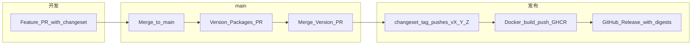

# 版本治理与发版（长期维护）

本文约定 **Octafuse Gateway** 单仓（`octafuse` + `@octafuse/core` / `@octafuse/proxy` / `@octafuse/admin`）的版本线、Git 标签、镜像与 GitHub Release 的关系，便于长期运维与回滚。

## 核心原则

| 项目 | 约定 |
|------|------|
| **版本真源** | Git 标签 **`vX.Y.Z`**（与 `package.json` 的 `version` 字段一致，无前导 `v`） |
| **版本线** | **Fixed 单线**：根包与三个 workspace **同一 semver**，不独立涨版本 |
| **对外制品** | **proxy / admin / migrate** 三镜像 **同一 tag** 发布；生产可追溯 **digest** |
| **变更记录** | [Changesets](https://github.com/changesets/changesets) → 合并入根目录 **`CHANGELOG.md`** |
| **npm workspaces** | 根目录 `package.json` 含 **`"."`**，使 **`octafuse`** 与 **`packages/*`** 一并被工具识别，从而纳入 Changesets **fixed** 组（与 `@octafuse/*` 同版本）。 |

详细操作入口见仓库 **[`.changeset/README.md`](../../.changeset/README.md)**。

## 自动化流水线



1. **`.github/workflows/release.yml`**（`push` → `main`）  
   - 若有未消费的 `.changeset/*.md`：打开 **「chore: version packages」** PR（更新版本、`CHANGELOG.md`）。  
   - 若无待处理 changeset 且版本已更新：执行 **`npx changeset tag`**，推送 **`vX.Y.Z`**。  
   - **不在此 workflow 创建 GitHub Release**（避免与 digest 说明重复）。

2. **`.github/workflows/octafuse-docker-images.yml`**（`push` → `tags/v*`）  
   - 构建并推送 **GHCR**（及可选 **ACR**）三镜像。  
   - 创建或更新 **GitHub Release**，正文中写入各镜像 **manifest digest**（便于按 digest 固定部署）。

3. **`.github/workflows/verify-package-versions.yml`**  
   - PR / `main` / `v*` 标签上校验：根与 workspace **`version` 一致**；在 **tag** 上校验 **`v` + version** 与标签名一致。

## 维护者日常操作

### 1. 普通功能合并

贡献者在 PR 中（或本地）执行：

```bash
npx changeset
```

选择 **patch / minor / major**，提交生成的 `.changeset/<id>.md`。

### 2. 生成版本 PR

合并上述 PR 到 **`main`** 后，**Release** workflow 会创建 **Version Packages** PR。**维护者审核 diff**（版本号、`CHANGELOG.md`）后合并。

### 3. 打标签与镜像

合并 Version PR 再次触发 **Release** → **`changeset tag`** 推送 **`vX.Y.Z`** → 触发 **Docker** workflow → 镜像与 **GitHub Release** 就绪。

### 4. 热修（patch）

对 **main** 上已发布版本做 patch：新 PR 同样带 **patch** 型 changeset → 重复 2–3 步，得到 **`vX.Y.(Z+1)`**。

## 回滚与应急

| 场景 | 建议 |
|------|------|
| **生产回滚** | 使用上一稳定 **`vX.Y.Z`** 的镜像 **digest**（见对应 GitHub Release 正文）拉取部署；或临时使用同一 tag（若确认该 tag 未被覆盖重建）。 |
| **标签错误** | **勿**在已推送公共镜像后改写远程 tag；应发 **新版本** 或 **新 tag** 并更新部署文档。 |
| **仅验证镜像** | 仍可使用 **Actions → Octafuse Docker Images → Run workflow**（`workflow_dispatch`），不依赖发版标签；**不会**自动写 GitHub Release。 |
| **CI 版本校验失败** | 检查四个 `package.json` 的 `version` 是否一致；标签推送时检查 **`v`** + `version` 是否与 **`github.ref_name`** 一致。 |

## Semver 与破坏性变更

- **MAJOR**：不兼容的 API / 配置 / 数据迁移要求（须在 PR 与 `CHANGELOG` 中写清迁移步骤）。  
- **MINOR**：向后兼容的功能与扩展。  
- **PATCH**：缺陷修复与内部重构（对外行为不变）。

预发布版本（如 `1.0.0-rc.0`）若使用，镜像 **`latest`** 不会更新（见 Docker workflow 中 `latest` 条件）。

## 相关文档

- [deployment-docker.md](./deployment-docker.md) — GHCR / ACR 与 Compose  
- [CHANGELOG.md](../../CHANGELOG.md) — 聚合变更记录  
- [`.changeset/README.md`](../../.changeset/README.md) — Changesets 快速说明  
