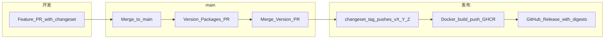

# 版本治理与发版（长期维护）

本文约定 **Octafuse Gateway** 单仓（`octafuse` + `@octafuse/core` / `@octafuse/proxy` / `@octafuse/admin`）的版本线、Git 标签、镜像与 GitHub Release 的关系，便于长期运维与回滚。

## 核心原则

| 项目 | 约定 |
|------|------|
| **版本真源** | Git 标签 **`vX.Y.Z`**（与 `package.json` 的 `version` 字段一致，无前导 `v`） |
| **版本线** | **Fixed 单线**：根包与三个 workspace **同一 semver**，不独立涨版本 |
| **对外制品** | **proxy / admin / migrate** 三镜像 **同一 tag** 发布；生产可追溯 **digest** |
| **变更记录** | [Changesets](https://github.com/changesets/changesets) → 合并入根目录 **`CHANGELOG.md`** |
| **npm workspaces** | 根目录 `package.json` 含 **`"."`**，使 **`octafuse`** 与 **`packages/*`** 一并被工具识别，从而纳入 Changesets **fixed** 组（与 `@octafuse/*` 同版本）。 |

详细操作入口见仓库 **[`.changeset/README.md`](../../.changeset/README.md)**。

## 自动化流水线



**并发**：`octafuse-docker-images.yml` 已配置 `concurrency`（`group: octafuse-docker-images-${{ github.ref }}`，`cancel-in-progress: false`）。同一 ref（如同一 `v*` tag）的重复触发会**串行**执行，避免并行推送互相覆盖 digest。

1. **`.github/workflows/release.yml`**（`push` → `main`）  
   - 若有未消费的 `.changeset/*.md`：打开 **「chore: version packages」** PR（更新版本、`CHANGELOG.md`）。  
   - 若无待处理 changeset 且版本已更新：执行 **`npx changeset tag`**，推送 **`vX.Y.Z`** Git 标签。  
   - **不在此 workflow 创建 GitHub Release**（避免与 digest 说明重复）。  
   - **Docker 触发**：若使用 **`CHANGESETS_GITHUB_TOKEN`（PAT）** 打 tag，GitHub 会把 **`push` tags** 交给下游，**`octafuse-docker-images`** 会按 tag 自动跑。若仅用默认 **`GITHUB_TOKEN`** 打 tag，**不会**自动触发其它 workflow（[官方说明](https://docs.github.com/en/actions/using-workflows/triggering-a-workflow#triggering-a-workflow-from-a-workflow)）；此时 **Release** 会在检测到 **`GITHUB_SHA` 上有 `v*` tag** 后，用 **`gh workflow run`** 主动触发 **Octafuse Docker Images**（需 workflow 已授予 **`actions: write`**，本仓已加）。

2. **`.github/workflows/octafuse-docker-images.yml`**（**`push` → `tags/v*`**，或由 Release **dispatch**；或 **`workflow_dispatch`**）  
   - 构建并推送 **GHCR**（及可选 **ACR**）三镜像。  
   - 在 **tag 发版**路径下创建/更新 **GitHub Release**：正文含 **`CHANGELOG.md` 中对应 `## X.Y.Z` 段落**（What's changed）与各镜像 **digest**。

3. **`.github/workflows/verify-package-versions.yml`**  
   - PR / `main` / `v*` 标签上校验：根与 workspace **`version` 一致**；在 **tag** 上校验 **`v` + version** 与标签名一致。

### 端到端顺序（你在 GitHub 上要做的）

| 步骤 | 谁触发 | 结果 |
|------|--------|------|
| 1. 功能 PR 带 `.changeset/*.md` 合并进 **`main`** | 你合并 PR | **Release** 跑完 → 出现 **Version Packages** PR（`changeset-release/main` → `main`） |
| 2. 审核并 **合并 Version PR** 到 **`main`** | 你合并 PR | **Release** 再跑 → **`changeset tag`** 推 **`vX.Y.Z`** → **Docker** 跑（PAT 直推 tag）或由 **Release** dispatch **Docker**（仅 `GITHUB_TOKEN` 时） |
| 3. 等 **Octafuse Docker Images** 绿 | CI | **GHCR** 有对应 tag 的镜像；**GitHub Release** 带 digest |
| 4. 部署 | 你 / 运维 | 用镜像 tag 或 digest 更新环境 |

**仅把代码推上 `main`、且没有待处理 changeset、也没有合并 Version PR** 时：不会打新 tag，**Docker 不会为「发版」自动跑**（这是预期）。日常开发提交可用 **`workflow_dispatch`** 手动打一版镜像做验证。

## Release workflow 无法创建 PR（`HttpError: ... not permitted to create or approve pull requests`）

`changesets/action` 会在远端分支 **`changeset-release/main`** 上提交版本变更，再 **调用 GitHub API 创建 PR**。若报错说明当前 **默认 `GITHUB_TOKEN` 被禁止创建 PR**（常见：仓库未勾选策略，或 **组织策略** 关闭该能力）。

### 做法 A（推荐）：放开仓库对默认 token 的 PR 权限

1. 打开仓库 **Settings** → **Actions** → **General**。  
2. **Workflow permissions** 选择 **Read and write permissions**。  
3. 勾选 **Allow GitHub Actions to create and approve pull requests**。  
4. 保存后，重新跑一次 **Release** workflow（或对 `main` 再推一次空 commit）。

官方说明：[Preventing GitHub Actions from creating or approving pull requests](https://docs.github.com/en/repositories/managing-your-repositorys-settings-and-features/enabling-features-for-your-repository/managing-github-actions-settings-for-a-repository#preventing-github-actions-from-creating-or-approving-pull-requests)（反向理解：需要 **允许** 时勾选上述选项）。

若 **组织级** 禁止 Actions 创建 PR，做法 A 不可用，请用做法 B。

### 做法 B：使用 PAT（Repo secret `CHANGESETS_GITHUB_TOKEN`）

1. 在 GitHub 创建 **Personal Access Token**（或 machine user）：  
   - **Classic**：勾选 **`repo`**（或至少 **Contents**、**Pull requests**）。  
   - **Fine-grained**：该仓库 **Contents: Read and write**、**Pull requests: Read and write**、**Metadata: Read**。  
2. 在仓库 **Settings** → **Secrets and variables** → **Actions** 中新增 secret：**`CHANGESETS_GITHUB_TOKEN`**，值为上述 PAT。  
3. **`.github/workflows/release.yml`** 已配置：`GITHUB_TOKEN` 优先使用 **`secrets.CHANGESETS_GITHUB_TOKEN`**，未设置时回退 **`secrets.GITHUB_TOKEN`**。  
4. **必读**：`changesets/action` 与 **`scripts/ci/push-root-release-tag.mjs`** 里的 `git push` 依赖 **`actions/checkout@v4` 的 `token`**。本仓已设为 `token: ${{ secrets.CHANGESETS_GITHUB_TOKEN || secrets.GITHUB_TOKEN }}`。若只把 PAT 写在 `env.GITHUB_TOKEN` 而 **checkout 仍用默认凭据**，`git push` tag 仍会走默认 **`GITHUB_TOKEN`**，**不会**链式触发 **Octafuse Docker Images**（dispatch 步骤还会因「已配 PAT」而跳过），表现为 **PAT 已配但 Docker 不跑**。

### 本次失败后的补救

若日志里已成功 **`git push origin HEAD:changeset-release/main`**，但 **创建 PR 失败**：到 GitHub 上打开分支 **`changeset-release/main`**，**手动发起 PR 合并到 `main`** 即可；合并后下一轮 Release 会尝试 **`changeset tag`**（若已无待处理 changeset）。

### Tag 未上 GitHub / Release 成功但无 `v*` 且无 Docker

1. **`changesets/action` + `createGithubReleases: false`**：上游实现里 **`git.pushTag` 与创建 GitHub Release 绑在一起**；为 false 时即使用 `changeset tag` 打出了**本地** tag，也不会替你 `git push`。本仓库用 **`npm run ci:changeset-tag-push`**（`changeset tag` + `scripts/ci/push-root-release-tag.mjs`）在 CI 里显式推送 **`vX.Y.Z`**。  
   - 补充：默认 **`privatePackages.tag` 为 `false`** 时，`changeset tag` **可能不会**生成 **`v*`**（仅 private workspace 时常见）。`push-root-release-tag.mjs` 会在缺少 **`vX.Y.Z`** 时于当前 **HEAD**（或已存在的 `octafuse@X.Y.Z` 等标签指向的提交）**补打** **`vX.Y.Z`** 再推送。若希望 Changesets 自行生成 `name@version` 类标签，可在 **`.changeset/config.json`** 设置 `"privatePackages": { "tag": true }`（可选）。  
2. **日志已跑 `changeset tag` 但后续仍报 HEAD 无 semver tag**：多为 **远端已有同名 `vX.Y.Z`**，`changeset tag` 会整段跳过（不写本地 tag）——需 **bump 新版本**（新 changeset + 再走 Version PR）或 **谨慎**处理远端错误 tag 后再跑一次 Release。  
3. **PAT 已配但 Docker 仍未跑**：核对 **`release.yml`** 中 **`actions/checkout`** 是否传入 **`token: ${{ secrets.CHANGESETS_GITHUB_TOKEN || secrets.GITHUB_TOKEN }}`**（见上文「做法 B」第 4 条）。

## 维护者日常操作

### 1. 普通功能合并

贡献者在 PR 中（或本地）执行：

```bash
npx changeset
```

选择 **patch / minor / major**，提交生成的 `.changeset/<id>.md`。

### 2. 生成版本 PR

合并上述 PR 到 **`main`** 后，**Release** workflow 会创建 **Version Packages** PR。**维护者审核 diff**（版本号、`CHANGELOG.md`）后合并。

### 3. 打标签与镜像

合并 Version PR 再次触发 **Release** → **`npm run ci:changeset-tag-push`**（`changeset tag` + 推送 **`vX.Y.Z`**）→ **Docker**（见上文「Docker 触发」：PAT 走 tag 事件；仅 `GITHUB_TOKEN` 时由 Release **dispatch**）→ **GitHub Release** 就绪（正文含 **`CHANGELOG.md` 对应版本段** + 镜像 **digest**）。

### 4. 热修（patch）

对 **main** 上已发布版本做 patch：新 PR 同样带 **patch** 型 changeset → 重复 2–3 步，得到 **`vX.Y.(Z+1)`**。

## 回滚与应急

| 场景 | 建议 |
|------|------|
| **生产回滚** | 使用上一稳定 **`vX.Y.Z`** 的镜像 **digest**（见对应 GitHub Release 正文）拉取部署；或临时使用同一 tag（若确认该 tag 未被覆盖重建）。 |
| **标签错误** | **勿**在已推送公共镜像后改写远程 tag；应发 **新版本** 或 **新 tag** 并更新部署文档。 |
| **仅验证镜像** | 仍可使用 **Actions → Octafuse Docker Images → Run workflow**（`workflow_dispatch`），不依赖发版标签；**不会**自动写 GitHub Release。 |
| **CI 版本校验失败** | 检查四个 `package.json` 的 `version` 是否一致；标签推送时检查 **`v`** + `version` 是否与 **`github.ref_name`** 一致。 |

## Semver 与破坏性变更

- **MAJOR**：不兼容的 API / 配置 / 数据迁移要求（须在 PR 与 `CHANGELOG` 中写清迁移步骤）。  
- **MINOR**：向后兼容的功能与扩展。  
- **PATCH**：缺陷修复与内部重构（对外行为不变）。

预发布版本（如 `1.0.0-rc.0`）若使用，镜像 **`latest`** 不会更新（见 Docker workflow 中 `latest` 条件）。

## 相关文档

- [deployment-docker.md](./deployment-docker.md) — GHCR / ACR 与 Compose  
- [CHANGELOG.md](../../CHANGELOG.md) — 聚合变更记录  
- [`.changeset/README.md`](../../.changeset/README.md) — Changesets 快速说明  
