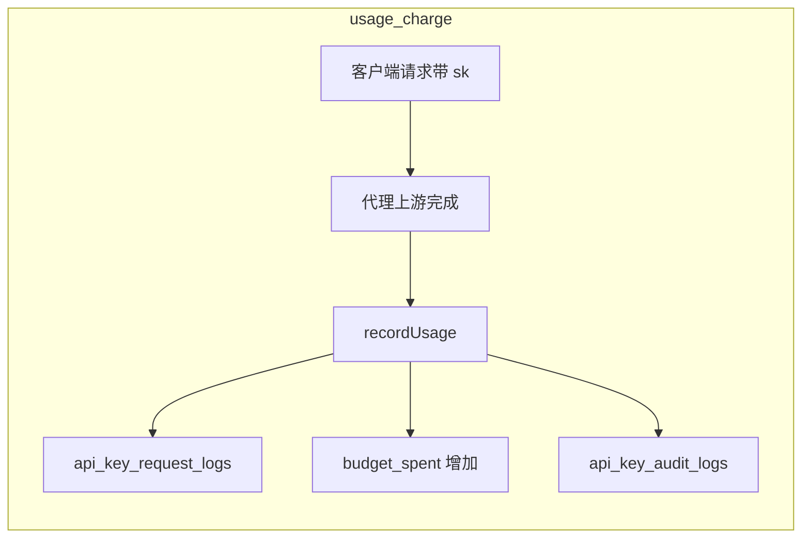

# API key audit logs（`api_key_audit_logs`）触发来源

`api_key_audit_logs` 记录**与 API Key 相关的各类变更**：用量扣费与预算周期重置、管理员对预算字段的调整，以及 **metadata / status / user_email** 等非预算字段变更（常见为 `admin_adjust`，详情见 `metadata` 列 JSON）。

## 为何「没人改配置却一直有新行」

最常见原因是 **`usage_charge`**：每次成功计费且 `charged_cost > 0` 的请求结束后，都会在同一事务里写入一条审计记录。此时 **`budget_max` / `budget_period` 等配置字段在单条日志里往往前后相同**，因为本条记录的是 **`budget_spent` 的增加**，不是改上限或周期。变化请看 **`before_spent` / `delta_spent` / `after_spent`**，并可通过 **`request_log_id`** 关联到 `api_key_request_logs` 表中对应请求（写入逻辑见 [`packages/core/src/storage/critical-write-paths.ts`](../../packages/core/src/storage/critical-write-paths.ts) 调度的 `insertRequestUsageAndChargeTx`，D1 实现在 [`packages/core/src/db/d1/critical-writes.impl.ts`](../../packages/core/src/db/d1/critical-writes.impl.ts)）。

## 写入场景（按常见频率）

### 1. 用量扣费（`usage_charge`，最高频）

- **代码**：[packages/proxy/src/services/usage-tracker.ts](../../packages/proxy/src/services/usage-tracker.ts) 的 `recordUsage`。
- **条件**：`params.status !== 'error'` 且 `chargedCost > 0`（见 `shouldChargeBudget`）。
- **同一事务/批次内**：插入 `api_key_request_logs`、对 `api_keys.budget_spent` 做增量更新、插入 `api_key_audit_logs`（`event_type: 'usage_charge'`，`actor_type: 'system'`，`reason_code: 'request_usage_charged_cost'`）。
- **调用链**：`/v1/*` 代理在流式结束后通过 [`scheduleBackgroundWork`](../../packages/proxy/src/runtime/schedule-background-work.ts) 调度 `recordUsage`（Workers 内为 `waitUntil`，Node/Docker 为 detached Promise；路由见 [`packages/proxy/src/routes/v1/`](../../packages/proxy/src/routes/v1/)，流式组装见 [`packages/proxy/src/services/proxy.ts`](../../packages/proxy/src/services/proxy.ts)）。

任意客户端（含桌面插件）使用该 API Key 调用模型并产生计费，即会产生新行；用户活跃或存在周期性调用时，会**持续**出现新审计记录。

### 2. 鉴权时的预算周期懒重置（`period_reset`）

- **代码**：[packages/proxy/src/services/api-key-auth.ts](../../packages/proxy/src/services/api-key-auth.ts) 的 `authenticateApiKey`。
- 若 `maybeResetBudget`（[`packages/core/src/services/key-service.ts`](../../packages/core/src/services/key-service.ts)）发现 `budget_reset_at` 已过期，会写回 `budget_spent` / `budget_reset_at`，并记审计：`event_type: 'period_reset'`，`reason_code: 'api_key_auth_lazy_reset'`。

### 3. 读密钥详情时的周期懒重置（`period_reset`）

- **代码**：`getKeyInfo`（[`packages/core/src/services/key-service.ts`](../../packages/core/src/services/key-service.ts)）。
- **典型原因码**：`get_key_info_lazy_reset`（管理员或 BFF 拉取密钥详情时触发）。

### 4. 新建密钥（`key_created`）

- **代码**：`getOrCreateKey`（[`packages/core/src/services/key-service.ts`](../../packages/core/src/services/key-service.ts)）。

### 5. 管理员 PATCH 密钥（`admin_adjust`）

- **代码**：[packages/admin/lib/services/admin/keys-service.ts](../../packages/admin/lib/services/admin/keys-service.ts) 的 `updateAdminKey`，在预算字段变化或仅 profile（metadata/status/user_email）变化时可能插入（经仓储 `budgetAuditLogs.insertApiKeyBudgetAuditLog`，实现见 [`packages/core/src/db/d1/api-key-budget-audit-logs.impl.ts`](../../packages/core/src/db/d1/api-key-budget-audit-logs.impl.ts) / [`packages/core/src/db/postgres/api-key-budget-audit-logs.impl.ts`](../../packages/core/src/db/postgres/api-key-budget-audit-logs.impl.ts)）。

## 对照列表数据

| 现象 | 含义 |
|------|------|
| `usage_charge` 且 `request_log_id` 非空 | 某次请求的计费流水，请对照 `api_key_request_logs` 同 id |
| `before_budget_max === after_budget_max` | 常见：本条为扣 `spent`，未改上限 |
| `period_reset` | 周期到期导致的归零/推进下次重置时间，不是人工改配置 |

## 流程示意

## 相关接口

- Admin：`GET /api/admin/budget-audit-logs`（内部路径 `/admin/budget-audit-logs`，见 [api/admin.md](../api/admin.md#admin-api-matrix)）。
