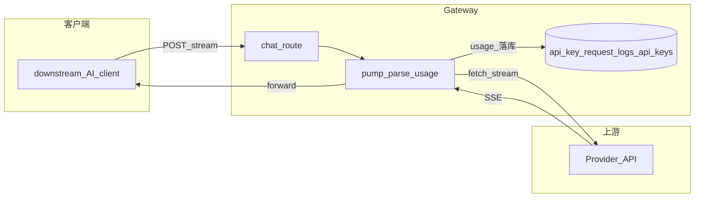
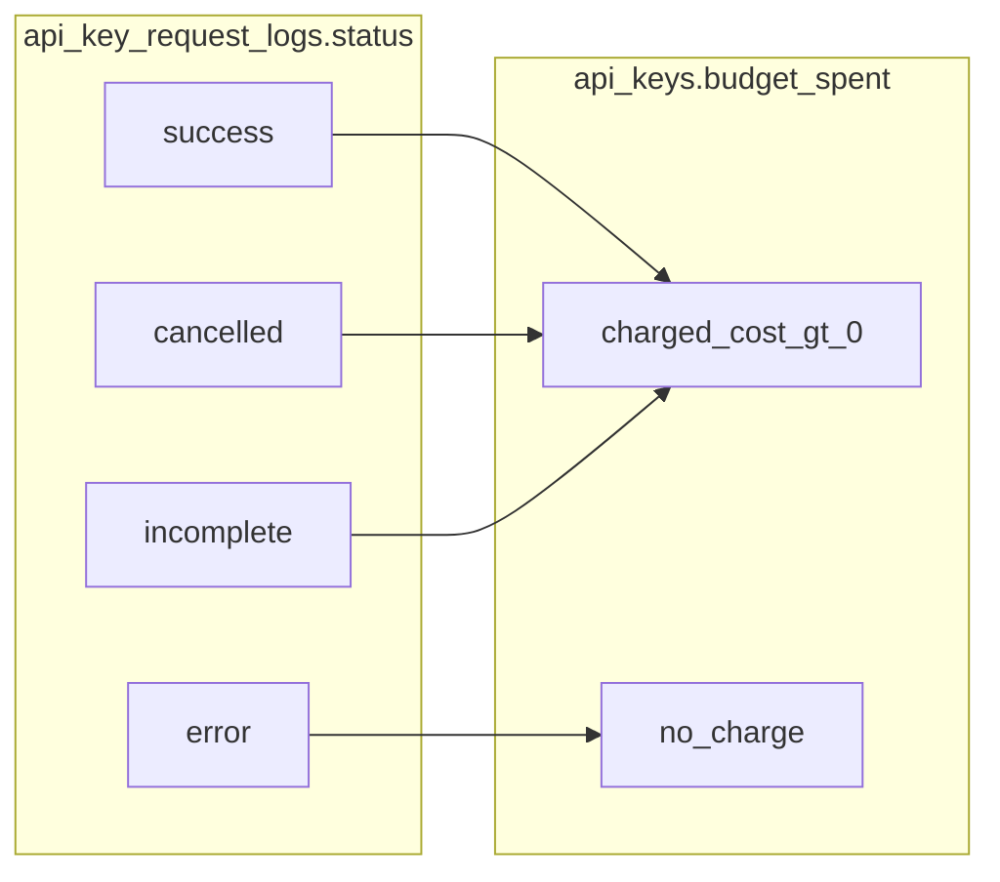

# 流式 Chat 计费与取消（当前实现）

Proxy（`@octafuse/proxy`）在流式请求（`POST /v1/chat/completions`、`POST /v1/messages`、Gemini `streamGenerateContent` 等；实现见 `packages/proxy/src/services/egress/*-driver.ts`）中解析上游 SSE 的 `usage`，写入 `api_key_request_logs` 并更新 `api_keys.budget_spent`。客户端中途取消或断连时，仍尽量在有限时间内从上游 **drain** 读出末尾 usage，避免长期 `incomplete` / 0 token。

## 架构示意



**旧问题（背景）**：若用 `TransformStream` + `flush()` 解析 usage，客户端 cancel 时 **`flush()` 不执行**，`usagePromise` 可能长期不 resolve。当前改为 **手动 pump**：断连后**只读上游、不写客户端**，在 `POST_DISCONNECT_DRAIN_MS` 内继续 read，再 `recordUsage`。

## 状态与扣费



- `success`：流正常结束。  
- `cancelled`：客户端断开，drain 后 resolve。  
- `incomplete`：异常或安全超时，usage 不全。  
- `error`：上游非 2xx；**不**按该次结果扣 `budget_spent`。  
- 扣费：`status !== 'error'` 且 `charged_cost > 0`（`charged_cost` 来自路由 `price_override.charged` 或模型 `pricing_profile`；`charged_factor` / `metered_factor` **不参与**金额乘法）。详见 `packages/proxy/src/services/usage-tracker.ts`。

## 常量

| 常量 | 典型值 | 含义 |
|------|--------|------|
| `POST_DISCONNECT_DRAIN_MS` | 各 driver 内定义（如 90s） | 断连后继续从上游读取的上限 |
| 安全超时 | 与路由 `USAGE_SAFETY_TIMEOUT_MS` 一致（如 5 min） | `usagePromise` 未 resolve 的兜底 |

**Workers**：`scheduleBackgroundWork` 内用 `ExecutionContext.waitUntil` 跑 `recordUsage`。**Node**：无 ExecutionContext 时退化为 detached Promise，语义仍是先响应、后台记账。

## Wrangler 配置

在 **`packages/proxy/wrangler.jsonc`** 中启用请求取消信号（与断连检测配合）：

```jsonc
"compatibility_flags": ["nodejs_compat", "enable_request_signal"],
```

## 主要代码位置

| 文件 | 说明 |
|------|------|
| `packages/proxy/src/services/egress/openai-driver.ts` | OpenAI SSE：pump + drain |
| `packages/proxy/src/services/egress/anthropic-driver.ts` | Anthropic 流式 |
| `packages/proxy/src/services/egress/gemini-driver.ts` | Gemini 流式 |
| `packages/proxy/src/services/proxy.ts` | 组装路由与 `requestSignal` |
| `packages/proxy/src/routes/v1/chat.ts` 等 | 传入 signal、`cancelled` 状态 |
| `packages/proxy/src/services/usage-tracker.ts` | `recordUsage` |
| `packages/proxy/wrangler.jsonc` | `enable_request_signal` |

## 限制与排查日志

- 上游在 drain 窗口内仍可能不发含 usage 的 chunk → 取消后 token 仍可能为 0。  
- 部分请求仅出现 “Network connection lost” 而无 signal → 依赖写失败或安全超时。

日志关键词：`client disconnected, draining upstream`、`drain timeout`、`recordUsage`、`status=cancelled`。
