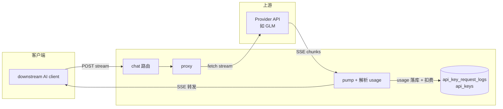
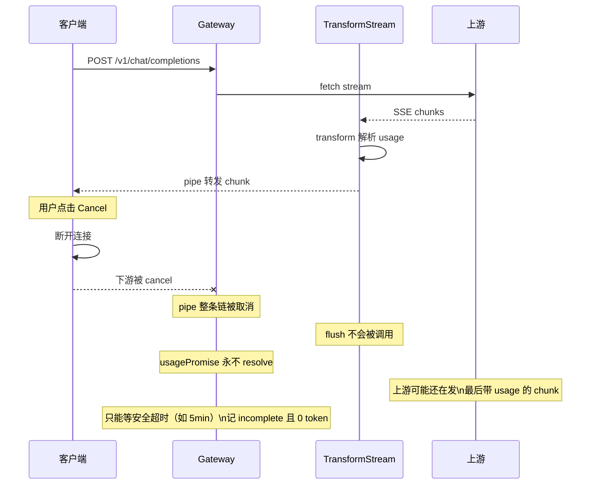
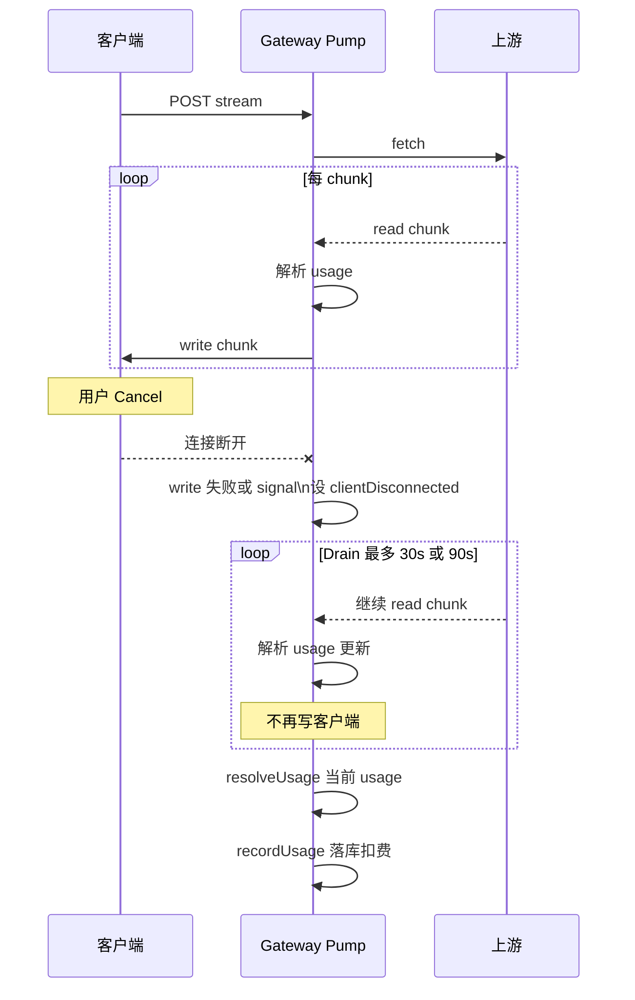
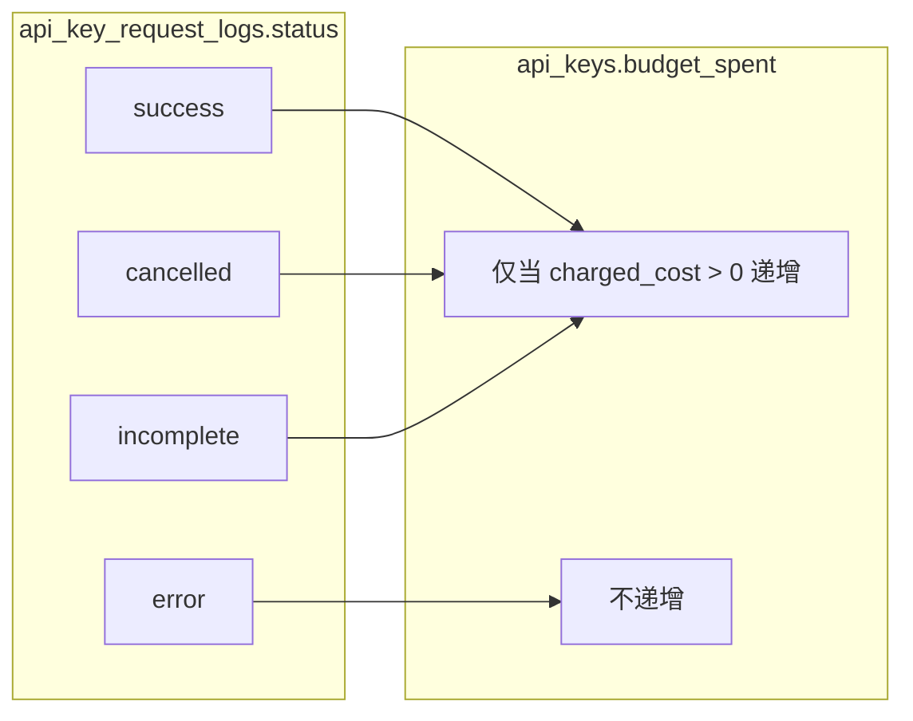

# 流式 Chat 计费与取消处理方案（当前实现）

本文档描述 **Octafuse** 的 Proxy（`@octafuse/proxy`）在**流式**对话场景下（`POST /v1/chat/completions`、`POST /v1/messages`、Gemini `streamGenerateContent` 等，实现位于 `packages/proxy/src/services/egress/*-driver.ts`），如何记录 `api_key_request_logs` 与更新 `api_keys.budget_spent`，尤其在客户端取消（如 downstream AI client 点击 Cancel）或连接中断时的行为。

---

## 示意图总览

### 整体架构（谁在中间、谁计费）



- 客户端发流式请求，Gateway 转发到上游并**边转边解析 SSE 里的 usage**，最后写入 `api_key_request_logs` 并更新 `api_keys.budget_spent`。
- 问题出在：**用户中途取消**时，旧实现拿不到「最后一个 chunk」里的 usage，导致计费/日志不准。

---

### 旧方案：Pipe + flush，取消时拿不到 usage



- **根因**：下游 cancel → 规范规定 **不调用 flush()** → 无法在「取消」时 resolve usage；且 pipe 一断，上游流也被取消，读不到末尾 chunk。

---

### 新方案：Pump + Drain，取消后继续读上游



- **要点**：上下游解耦（手动 read/write），断连后**只读不写**，在 drain 时间内尽量拿到上游最后的 usage，再 resolve 并落库。

---

### 状态与计费关系（status 与 budget_spent）



- `success`：流正常结束。  
- `cancelled`：客户端断开（如用户取消），drain 后 resolve。  
- `incomplete`：流异常结束或安全超时，无/部分 usage。  
- `error`：上游 HTTP 非 2xx；**不写 charged 扣费**。  
- 其余状态由 `recordUsage` 计算 **`charged_cost`**（路由 **`price_override.charged`** 优先，否则模型 **`pricing_profile`** 阶梯；**金额**仅由 tiers/profile 决定，`price_override` 中的 **`charged_factor`** / **`metered_factor`** **不参与** `charged_cost` 乘法）；**仅当 `status !== 'error'` 且 `charged_cost > 0`** 时递增 `api_keys.budget_spent`。因此 incomplete/cancelled 若 usage 全 0 或 profile 单价为 0，可能仍不扣费。

---

## 1. 背景与问题

- 客户端以流式方式调用 gateway 的 `POST /v1/chat/completions`，gateway 转发到上游 provider，并解析 SSE 中的 `usage` 写入 `api_key_request_logs` 并更新 `api_keys.budget_spent`。
- 当用户点击 Cancel 或因网络等原因连接中断时，原先出现：
  - **计费/日志不准**：request log 记为 `incomplete`、`total_tokens=0`、`charged_cost=0`，或迟迟不落库直到安全超时。
  - **取消时无 token/cost**：上游已在产生费用，但 gateway 因拿不到末尾 usage 而记为 0。

## 2. 根因分析

### 2.1 原始实现（TransformStream + flush）

- 流式响应通过 `response.body.pipeThrough(transform)` 将上游 SSE 直接 pipe 到下游。
- Usage 在 `TransformStream` 的 **`flush()`** 中解析并 resolve `usagePromise`。
- **问题**：`flush()` 只在流**正常结束**时调用。客户端断开时，下游 readable 被 cancel，**`flush()` 不会被调用**（WHATWG Streams 规定），导致 `usagePromise` 永不 resolve，最终依赖安全超时，以 0 token 记 `incomplete`。

### 2.2 上下游耦合

- 上游读取与下游写出耦合在一条 pipe 链上，客户端断开后整条链被取消，无法继续从上游读数据以获取末尾的 usage chunk（多数上游在**最后一个 chunk** 才带 usage）。

### 2.3 Cloudflare Workers 行为

- **request.signal**：需在 `packages/proxy/wrangler.jsonc` 中开启 `enable_request_signal`，客户端断开时才会触发 `request.signal` 的 abort。
- **稳定性**：实践中 signal 在部分请求（尤其 keep-alive 后续请求）上可能不触发，仅出现 "Network connection lost"，故不能只依赖 signal。

## 3. 当前方案：Pump + Drain

### 3.1 总体思路

- **上下游解耦**：不再使用 `pipeThrough`，改为**手动 pump**：从上游 `ReadableStream` 读 chunk，解析 SSE 中的 usage，再写入下游 `WritableStream`。
- **signal 只设标志、不抛**：`request.signal` 触发时只设置 `usage.cancelled = true` 和 `clientDisconnected = true`，**不 throw**，这样读循环继续执行，不会出现「signal 先触发导致无法 drain」。
- **断连检测**：以 **writer.write() 失败** 或 **request.signal 触发** 判定客户端已断开；任一发生即进入 **drain**。
- **Drain 阶段**：一旦判定客户端已断开，在限制时间内**继续从上游读取**（不再写下游），尽量拿到末尾的 usage chunk，再 resolve，从而在取消场景下也尽量有 token/cost。

### 3.2 数据流概览

```
客户端请求 → chat 路由 → proxyChatCompletions(routes, body, requestSignal)
                              ↓
                    上游 fetch(provider) → response.body (ReadableStream)
                              ↓
                    streamResponseWithUsage(): TransformStream(readable, writable)
                    pumpWithUsageTracking(upstream=response.body, downstream=writable, usage, resolveUsage, requestSignal)
                              ↓
                    - 循环: await reader.read()
                    - parseSSEChunk(value) → 更新 usage
                    - 若 !clientDisconnected: await writer.write(value)；失败则设 clientDisconnected、usage.cancelled，进入 drain
                    - request.signal abort: 仅设 usage.cancelled、clientDisconnected，不 throw
                    - 若 clientDisconnected 且已过 POST_DISCONNECT_DRAIN_MS → reader.cancel()，break
                              ↓
                    finally: resolveUsage(usage)，writer.close()/abort()
                              ↓
                    readable → 作为 Response body 返回客户端
                    usagePromise resolve → scheduleBackgroundWork → recordUsage
```

**运行时**：在 Cloudflare Workers 中，`scheduleBackgroundWork` 内部使用 `ExecutionContext.waitUntil` 延长请求生命周期以执行 `recordUsage`。在 **Node（Docker / `@hono/node-server`）** 下没有 ExecutionContext，同一函数会降级为 detached Promise，避免访问 `c.executionCtx` 抛错，语义仍为「先返回响应，再在后台异步记账」。

### 3.3 常量与超时

| 常量 | 当前值 | 含义 |
|------|--------|------|
| `POST_DISCONNECT_DRAIN_MS` | 90_000（`openai-driver` / `anthropic-driver` / `gemini-driver` 各自定义） | 客户端断开后，最多继续从上游读取的时长（ms），用于争取拿到末尾 usage。 |
| 各协议路由安全超时 | 5 min（如 `chat.ts` 等与 `USAGE_SAFETY_TIMEOUT_MS` 一致） | 若 `usagePromise` 始终未 resolve 的兜底时间，届时以 `incomplete` 记录。 |

**说明**：Drain 阶段主要为 I/O 等待（等上游发 chunk），Cloudflare Workers 按 **CPU 时间** 计费，不按墙钟时间，因此 drain 几乎不增加计费。

### 3.4 计费与状态

- **api_key_request_logs.status**：`success` | `error` | `incomplete` | `cancelled`。
- **扣费条件**（见 `packages/proxy/src/services/usage-tracker.ts`）：`status !== 'error'` **且** `charged_cost > 0`。`charged_cost` 由用量与 **`price_override.charged`**（若有）否则 **`models.pricing_profile`** 阶梯单价算出；**`charged_factor` / `metered_factor` 不参与**该金额。与状态无简单一一对应；`error` 不写日志扣费批次中的 budget 更新。

## 4. 配置要求

在 **`packages/proxy/wrangler.jsonc`** 中启用 request 取消信号：

```jsonc
"compatibility_flags": ["nodejs_compat", "enable_request_signal"],
```

未启用时，客户端断开不会触发 `request.signal`，只能依赖 `writer.write()` 失败来检测断连。

## 5. 涉及文件与实现要点

| 文件 | 要点 |
|------|------|
| **packages/proxy/src/services/egress/openai-driver.ts** | OpenAI SSE：`pumpWithUsageTracking`、`POST_DISCONNECT_DRAIN_MS`、`dispatchOpenAiRoute` 传入 `requestSignal`。 |
| **packages/proxy/src/services/egress/anthropic-driver.ts** | Anthropic 流式：同类 pump + drain。 |
| **packages/proxy/src/services/egress/gemini-driver.ts** | Gemini 流式：同类 pump + drain。 |
| **packages/proxy/src/services/proxy.ts** | `proxyChatCompletions` / `proxyAnthropicMessages` / `proxyGeminiContent` 组装路由 failover，并把 `requestSignal` 交给各 driver。 |
| **packages/proxy/src/routes/v1/chat.ts** 等 | 将 `c.req.raw.signal` 传入 proxy；根据 `usageCollected.cancelled` 设 `status = 'cancelled'`；`USAGE_SAFETY_TIMEOUT_MS` 兜底；异步记账经 `runtime/schedule-background-work.ts`（Worker 用 `waitUntil`，Node 无 ExecutionContext 时降级）。 |
| **packages/proxy/src/services/usage-tracker.ts** | `recordUsage`：`status !== 'error' && chargedCost > 0` 时递增 `budget_spent`。 |
| **packages/proxy/wrangler.jsonc** | `compatibility_flags` 包含 `enable_request_signal`。 |

## 6. 已知限制与现象

- **部分请求仍只出现 "Network connection lost"**：Workers 可能不触发 signal，且写失败也未在超时前发生，则 usagePromise 可能一直未 resolve，最终由 5 分钟安全超时记为 `incomplete`。
- **取消时 token 仍可能为 0**：若上游在 drain 窗口内未发送含 usage 的 chunk（例如上游很慢或只在流完全结束后才发 usage），则 resolve 时 usage 可能仍为 partial/0。

## 7. 日志与排查

- **客户端断开并进入 drain**  
  - `[Gateway Proxy] client disconnected, draining upstream for usage input_tokens=... output_tokens=...`
- **Drain 超时**  
  - `[Gateway Proxy] drain timeout, resolving with partial usage`
- **recordUsage**  
  - `[Gateway Usage] recordUsage model_id=... status=cancelled ...`
- **api_key_request_logs 表**  
  - `status` 可能为 `success` | `error` | `incomplete` | `cancelled`；是否增加 `budget_spent` 以 **`charged_cost > 0`** 为准（非 error）。
