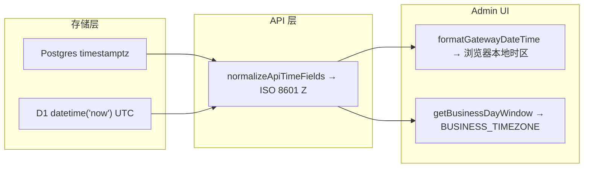

# 时间与时区（当前实现）

Gateway 在**存储**、**API 输出**、**Admin 逐条显示**与**日界统计**上采用不同口径。本文记录当前代码契约，便于 review 与跨模块对照。

## 总览

| 维度 | 口径 | 说明 |
|------|------|------|
| 数据库写入 | **UTC** | 各驱动统一存 UTC instant |
| API 响应时间字段 | **ISO 8601 UTC（`Z`）** | `normalizeApiTimeFields` 深度归一化 |
| Admin 逐条时间戳显示 | **浏览器本地时区** | `formatGatewayDateTime` 未传 `timeZone` |
| 「今日 / 日界」统计 | **`system_config.BUSINESS_TIMEZONE`** | 仅聚合口径，不转换逐条显示 |

## 1. 存储：一律 UTC

### PostgreSQL

Drizzle schema 中时间列使用 `timestamp(..., { withTimezone: true, mode: 'string' })`，底层为 `timestamptz`，语义为 UTC instant。

- 实现：`packages/core/src/storage/drizzle/schema.pg.ts`
- 迁移：`packages/core/migrations-postgres/0001_baseline.sql`

### D1 / SQLite

时间列多为 `TEXT`，默认值 `datetime('now')`。SQLite 的 `datetime('now')` 返回 UTC，形态为 `YYYY-MM-DD HH:MM:SS`（无偏移后缀）。

- 迁移：`packages/core/migrations-d1/0001_baseline.sql`（示例：`created_at TEXT NOT NULL DEFAULT (datetime('now'))`）

### MySQL

与 Postgres 对齐，迁移目录：`packages/core/migrations-mysql/`。

### 应用层写入

业务代码写入时间时，普遍使用 `new Date().toISOString()` 或 `toISOString().slice(0, 19).replace('T', ' ')` 等形式，语义均为 UTC。

## 2. API 输出：统一 ISO 8601 UTC

对外 Admin / 部分 Proxy 响应在序列化前经 `normalizeApiTimeFields` 处理（`packages/core/src/lib/time-format.ts`）：

- **D1 / SQLite 无时区串**（`YYYY-MM-DD HH:MM:SS`）：按历史约定视为 UTC，输出 `YYYY-MM-DDTHH:MM:SS.000Z`。
- **PostgreSQL 等带偏移或 `T` 分隔的串**：经 `Date` 解析后统一为 `toISOString()`（带 `Z`）。

约定的时间字段名（`API_TIME_KEYS`）：

- `created_at`
- `updated_at`
- `budget_reset_at`
- `before_budget_reset_at`
- `after_budget_reset_at`
- `last_active_at`

下游门户（如 `soloent-web`）调用 `{GATEWAY_MASTER_URL}/api/admin/*` 时，应把上述字段当作 **UTC instant**，自行按产品需求转换展示时区。

## 3. Admin UI：逐条时间戳 = 浏览器本地时区

Admin 前端格式化函数位于 `packages/admin/lib/datetime.ts`：

- `parseGatewayDateTime(raw)`：将 API 串（含 D1 无 `Z` 形态）解析为 `Date`（UTC instant）。
- `formatGatewayDateTime(raw, timeZone?)`：用 `Intl.DateTimeFormat` 渲染；**`timeZone` 为可选参数**。

当前各列表 / 详情页（`request-logs`、`keys`、`users`、`audit-logs`、`analytics` 等）均调用 `formatGatewayDateTime(iso)` **未传入 `timeZone`**。此时 `Intl.DateTimeFormat` 使用运行环境（浏览器）的**本地时区**。

因此：

- `created_at`、`updated_at`、`budget_reset_at` 等**逐条记录的时间戳**，与 `system_config.BUSINESS_TIMEZONE` **无关**。
- 同一 Admin 实例，不同地区管理员看到的本地时间可能不同。

### 分析页时间窗筛选

`packages/admin/lib/analytics-range.ts` 中：

- 快捷预设（`1h`、`7d` 等）的 `start_date` / `end_date` 以 **UTC** 字符串传给 API（`toISOString().slice(0, 19).replace('T', ' ')`）。
- 自定义范围：`datetime-local`（浏览器本地）→ `datetimeLocalToApiUtc` 转为 UTC 再查询。

查询边界始终是 UTC；与 BUSINESS_TIMEZONE 无直接关系。

## 4. `BUSINESS_TIMEZONE`：仅用于日界 / 「今日」统计

### 配置来源

- 键：`system_config.BUSINESS_TIMEZONE`
- 种子默认：`UTC`（`packages/core/migrations-{d1,postgres,mysql}/0002_seed.sql`）
- Admin Config 页描述：`IANA timezone for day-boundary logic (today stats, analytics)`
- 非法或未配置 IANA 名称时回落 `UTC`（`packages/core/src/lib/business-timezone.ts` → `getBusinessTimezone`）

### 行为

`getBusinessDayWindow(now, businessTimeZone)` 根据业务时区计算「今天」的 `dateKey`，并返回与 DB `created_at` 比较的 **UTC 边界字符串**（`startUtcSql`、`endExclusiveUtcSql`）。

当前主要调用点：

- Admin 仪表盘「今日」卡片：`packages/admin/lib/services/admin/dashboard-service.ts` → `getAdminStatsService` 中 `todayRequestsCount`、`todayCost`、`errorRate` 等。

即 **BUSINESS_TIMEZONE 决定「哪一天算今天」的聚合口径**（例如 `Asia/Shanghai` 下 00:00–24:00 对应哪段 UTC 区间），**不参与**单条时间戳在 UI 上的格式化。

API 文档中的相关说明见 [`docs/api/admin.md`](./api/admin.md)（业务日界一节）。

## 5. 小结与常见误解

| 误解 | 实际 |
|------|------|
| 「显示都按 Business timezone」 | 仅日界统计用 BUSINESS_TIMEZONE；逐条时间戳按**浏览器本地时区** |
| 「D1 存的是本地时间」 | D1 `datetime('now')` 与代码约定均视为 **UTC** |
| 「API 返回本地时间」 | API 统一 **ISO 8601 UTC（Z）** |

## 6. 若需统一按业务时区显示（未实现）

若产品要求 Admin 所有时间列与 `BUSINESS_TIMEZONE` 一致（而非查看者浏览器时区），需要：

1. 在 Admin 加载 `system_config.BUSINESS_TIMEZONE`（或随 layout 下发）。
2. 各页 `formatGatewayDateTime(raw, businessTimeZone)` 传入该 IANA 名称。
3. 在 UI 上标注当前展示时区，避免与下游门户（可能用另一套时区）混淆。

当前实现**未**做上述统一；本文仅记录现状。

## 相关代码索引

| 模块 | 路径 |
|------|------|
| 业务时区读取与日界窗口 | `packages/core/src/lib/business-timezone.ts` |
| API 时间归一化 | `packages/core/src/lib/time-format.ts` |
| Admin 显示格式化 | `packages/admin/lib/datetime.ts` |
| 分析时间窗 UTC 转换 | `packages/admin/lib/analytics-range.ts` |
| 仪表盘今日统计 | `packages/admin/lib/services/admin/dashboard-service.ts` |
| Config UI | `packages/admin/app/gateway/config/page.tsx` |
| Postgres schema | `packages/core/src/storage/drizzle/schema.pg.ts` |
